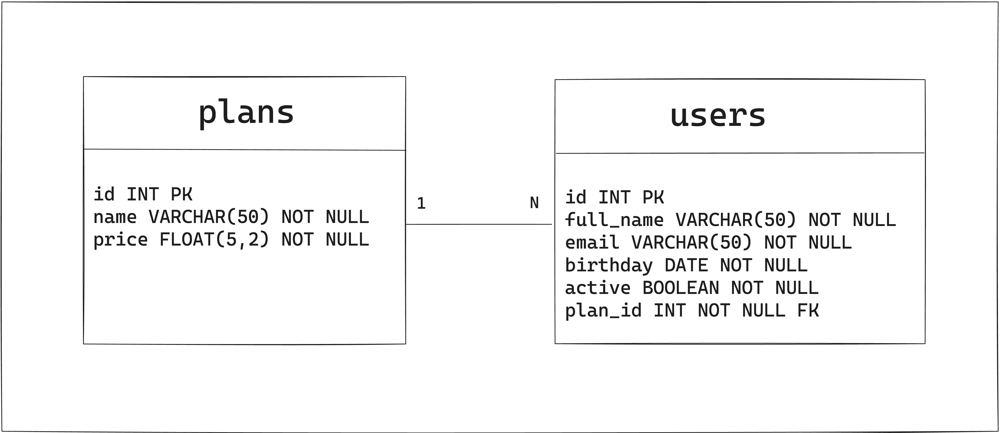
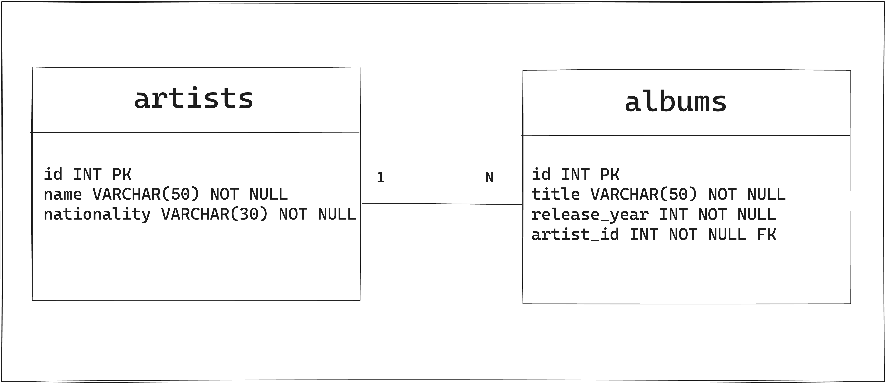
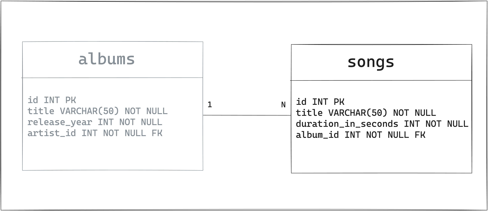
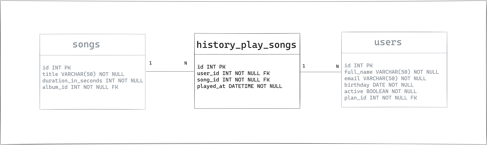
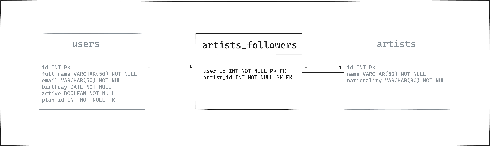

# Trybefy

Boas-vindas ao repositório do projeto Trybefy.

Para realizar o projeto, atente-se a cada passo descrito a seguir, e se tiver **qualquer dúvida**, nos envie no _Slack_ da turma! #vqv 🚀

Aqui, você vai encontrar os detalhes de como estruturar o desenvolvimento do seu projeto a partir desse repositório, utilizando uma branch específica e um _Pull Request_ para colocar seus códigos.

## Termos e acordos

Ao iniciar este projeto, você concorda com as diretrizes do [Código de Conduta e do Manual da Pessoa Estudante da Trybe](https://app.betrybe.com/learn/student-manual/codigo-de-conduta-da-pessoa-estudante).

## Entregáveis

<details>
<summary><strong>🤷🏽‍♀️ Como entregar</strong></summary></br>

Para entregar o seu projeto você deverá criar um _Pull Request_ neste repositório.

Lembre-se que você pode consultar nosso conteúdo sobre [Git & GitHub](https://app.betrybe.com/learn/course/5e938f69-6e32-43b3-9685-c936530fd326/module/fc998c60-386e-46bc-83ca-4269beb17e17/section/fe827a71-3222-4b4d-a66f-ed98e09961af/day/1a530297-e176-4c79-8ed9-291ae2950540/lesson/2b2edce7-9c49-4907-92a2-aa571f823b79) e nosso [Blog - Git & GitHub](https://blog.betrybe.com/tecnologia/git-e-github/) sempre que precisar!

</details>
  
<details>
<summary><strong>🧑‍💻 O que deverá ser desenvolvido</strong></summary></br>

No projeto Trybefy você irá criar queries para revisar e consolidar os principais conceitos apresentados ao longo da seção. Você construirá um banco de dados, suas respectivas tabelas e queries para inserção, alteração, remoção e pesquisa de dados.

O caso de uso escolhido, é um aplicativo de Streaming de músicas, o Trybefy 😁! Neste aplicativo, as pessoas usuárias podem ouvir suas músicas favoritas, seguir artistas e ter acesso ao histórico de músicas reproduzidas. Até o final do projeto, você terá uma base de dados com as tabelas representadas no diagrama abaixo:

||
|:--:|
|Diagrama do banco Trybefy|

As tabelas acima, serão criadas ao longo dos requisitos do projeto e para fazer isso, separamos o projeto em partes! Siga o _README_ e construa a base de dados `Trybefy` 😉.

</details>
  
<details>
  <summary><strong>📝 Habilidades a serem trabalhadas </strong></summary></br>

Neste projeto, verificamos se você é capaz de:

- Utilizar a linguagem de consulta estruturada _(Structured Query Language - SQL)_;
- Utilizar SQL para: Criar um banco de dados e suas respectivas tabelas;
- Utilizar SQL para: Inserir, alterar, deletar e pesquisar dados;
- Utilizar SQL para: Relacionar tabelas dentro do banco de dados;
- Utilizar SQL para: Aplicar os conceitos de chaves primárias e estrangeiras;
- Extrair dados de várias tabelas que possuem relacionamentos;
- Ordenar e limitar dados através de consultas SQL;
- Agrupar e filtrar dados dentro destes grupos em consultas SQL;

</details>

<details>
<summary><strong>🗓 Data de Entrega</strong></summary></br>

- Este projeto é individual.
- Será `X` dias de projeto.
- Data para entrega final do projeto:`28/11/2023 23:59`.

</details>

## Orientações

<details>

<summary><strong>📝 Instruções para entregar seu projeto: Rodando no Docker vs Localmente</strong></summary></br>
  
- Rode o serviço `node` com o comando `docker-compose up -d`.
    - Esse comando irá inicializar dois containers, um chamado `trybefy` e o outro `trybefy_db`.

- Use o comando `docker exec -it trybefy sh`.
    - Ele te dará acesso ao terminal interativo do container criado pelo compose, que está rodando em segundo plano.

- Instale as dependências [**Caso existam**] com `npm install`
    - Os requisitos do projeto devem estar no diretório `src`;
    - Cada requisito deve estar em um arquivo e cada arquivo deve ter o nome `n-challenge.sql`, onde `n` é o número do requisito.

</details>


<details>
<summary><strong>‼ Antes de começar a desenvolver</strong></summary></br>

1. Clone o repositório

- Use o comando: `git clone git@github.com:tryber/sd-034-project-trybefy.git`
- Entre na pasta do repositório que você acabou de clonar:
    - `cd <diretório-do-projeto>`

2. Instale as dependências

    - npm install

3. Crie uma branch a partir da branch `main`

- Verifique que você está na branch `main`
    - Exemplo: `git branch`
- Se você não estiver, mude para a branch `main`
    - Exemplo: `git checkout main`
- Agora, crie uma branch à qual você vai submeter os `commits` do seu projeto:
    - Você deve criar uma branch no seguinte formato: `nome-sobrenome-nome-do-projeto`;
    - Exemplo: `git checkout -b maria-soares-lessons-learned`

4. Crie na raiz do projeto os arquivos que você precisará desenvolver:

- Verifique que você está na raiz do projeto:
    - Exemplo: `pwd` -> o retorno vai ser algo tipo _/Users/maria/code/**sd-0x-project-lessons-learned**_
- Crie os arquivos index.html e style.css:
    - Exemplo: `touch index.html style.css`

5. Adicione as mudanças ao _stage_ do Git e faça um `commit`

- Verifique que as mudanças ainda não estão no _stage_:
    - Exemplo: `git status` (devem aparecer listados os novos arquivos em vermelho)
- Adicione o novo arquivo ao _stage_ do Git:
    - Exemplo:
        - `git add .` (adicionando todas as mudanças - _que estavam em vermelho_ - ao stage do Git)
        - `git status` (devem aparecer listados os arquivos em verde)
- Faça o `commit` inicial:
    - Exemplo:
        - `git commit -m 'iniciando o projeto. VAMOS COM TUDO :rocket:'` (fazendo o primeiro commit)
        - `git status` (deve aparecer uma mensagem tipo _nothing to commit_ )

6. Adicione a sua branch com o novo `commit` ao repositório remoto

- Usando o exemplo anterior: `git push -u origin maria-soares-lessons-learned`

7. Crie um novo `Pull Request` _(PR)_

- Vá até a página de _Pull Requests_ do [repositório no GitHub](https://github.com/tryber/sd-0x-project-lessons-learned/pulls)
    - Clique no botão verde _"New pull request"_
    - Clique na caixa de seleção _"Compare"_ e escolha a sua branch **com atenção**
- Coloque um título para o seu _Pull Request_
    - Exemplo: _"Cria tela de busca"_
- Clique no botão verde _"Create pull request"_

- Adicione uma descrição para o _Pull Request_, um título nítido que o identifique, e clique no botão verde _"Create pull request"_

||
|:--:|
|Exemplo de pull request|

- Volte até a [página de _Pull Requests_ do repositório](https://github.com/tryber/sd-0x-project-lessons-learned/pulls) e confira que o seu _Pull Request_ está criado

</details>

<details>
<summary><strong>⌨️ Durante o desenvolvimento</strong></summary></br>

Faça `commits` das alterações que você fizer no código regularmente, pois assim você garante visibilidade para o time da Trybe e treina essa prática para o mercado de trabalho :) ;

- Lembre-se de sempre após um (ou alguns) `commits` atualizar o repositório remoto;
- Os comandos que você utilizará com mais frequência são:
    - `git status` _(para verificar o que está em vermelho - fora do stage - e o que está em verde - no stage)_;
    - `git add` _(para adicionar arquivos ao stage do Git)_;
    - `git commit` _(para criar um commit com os arquivos que estão no stage do Git)_;
    - `git push -u origin nome-da-branch` _(para enviar o commit para o repositório remoto na primeira vez que fizer o `push` de uma nova branch)_;
    - `git push` _(para enviar o commit para o repositório remoto após o passo anterior)_.

</details>
  
<details>
<summary><strong>🤝 Depois de terminar o desenvolvimento (opcional)</strong></summary></br>

Para sinalizar que o seu projeto está pronto para o _'Code Review'_ dos seus colegas, faça o seguinte:

- Vá até a página **DO SEU** _Pull Request_, adicione a label de _'code-review'_ e marque seus colegas:

- No menu à direita, clique no _link_ **'Labels'** e escolha a _label_ **code-review**;

- No menu à direita, clique no _link_ **'Assignees'** e escolha **o seu usuário**;

- No menu à direita, clique no _link_ **'Reviewers'** e digite `students`, selecione o time `tryber/students-sd-034`.

Caso tenha alguma dúvida, [aqui tem um vídeo explicativo](https://vimeo.com/362189205).

⚠️ **Lembre-se que garantir que todas as _issues_ comentadas pelo Linter estão resolvidas!** ⚠️

</details>
  <details>
<summary><strong>🛠 Testes</strong></summary></br>

> **Atenção ⚠️:** 
> - Não execute o comando `npm audit fix`!!! Ele atualiza as dependências do projeto, e essa atualização gera conflitos com o avaliador.
> - O `Git` não vem configurado com suas credenciais dentro do container, faça commits fora do container.
> - Use a versão 1.29 do Docker Compose.
> - Não altere o arquivo `docker-compose.yml`.
> - Verifique se há outro container ou serviço utilizando na porta do projeto (lembrando que o MySQL utiliza aporta`3306`).
> - Ao executar os testes, eles sempre irão apagar e recriar o banco de dados.

Para executar os testes de seu projeto:
- Utilize o comando `docker-compose up -d` para subir os containers em segundo plano;
- Utilize o comando `docker exec -it trybefy sh` para entrar no container do projeto;
- Dentro do container, utilize o comando `npm install` para instalar as dependências do projeto;
- Utilize o comando `npm run test` para executar todos os testes;
- Ou utilize o comando `npm run test n_`, onde `n` é o número do exercício, ex: `npm run test 01_`.

> **De olho na dica 👀:** 
> - A extensão `Dev - Containers` é indicada para que você possa desenvolver sua aplicação no container Docker direto no VS Code, como você faz com seus arquivos locais.
> - Para atualizar a versão do Docker Compose utilize os passos abaixo:

```bash
  sudo rm /usr/local/bin/docker-compose
  sudo curl -L "<https://github.com/docker/compose/releases/download/1.29.0/docker-compose-$(uname> -s)-$(uname -m)" -o /usr/local/bin/docker-compose
  sudo chmod +x /usr/local/bin/docker-compose
```

</details>

## Requisitos do projeto

### 01. Crie uma base de dados chamada `Trybefy`

<details>
<summary>Detalhamento do requisito</summary></br>

Crie no arquivo `src/01_challenge.sql`. a base de dados que será utilizada durante todo o projeto.

**O que será testado:**
- Será validado se o requisito foi construído no local pedido;
- Será validado se a base de dados `Trybefy` é criada;
- Será validado se a base de dados `Trybefy` esta selecionada;

</details>

---

A partir desse ponto, iremos modelar o banco de dados em cinco passos! Cada passo irá adicionar novas tabelas e novos dados ao banco de dados `Trybefy`. Escreva as queries corretamente para adicionar, consultar, atualizar e remover dados.

---

## Primeiro passo da modelagem - Pessoas usuárias e Planos

### 02. Crie e popule as tabelas `plans` e `users`

<details>
<summary>Detalhamento do requisito:</summary></br>

Levando em consideração que:
- Uma pessoa só pode estar associada a um plano;
- Um plano pode estar associado com várias pessoas.

Com base no diagrama, crie e popule as tabelas `plans` e `users`, no arquivo `src/02_challenge.sql`.

|
|:--:|
|Tabela `plans` e `users`|

- Os atributos da tabela `plans` são:
    - `id`: Número inteiro, auto incremento e chave primária;
    - `name`: String não nula de no máximo 50 caracteres;
    - `price`: Número não nulo, com cinco algarismos e duas casas decimais.
- Os atributos da tabela `users` são:
    - `id`: Número inteiro, auto incremento e chave primária;
    - `full_name`: String não nula de no máximo 50 caracteres;
    - `email`: String não nula, única e de no máximo 50 caracteres;
    - `birthday`: Data de aniversário no formato padrão;
    - `active`: Booleano que por padrão inicia como true;
    - `plan_id`: Número inteiro não nulo e chave estrangeira para a tabela `plans`.

Os dados a serem inseridos na tabela `plans` são:

| id | name | price |
|----|-------------|-------|
| 1  |  Anual      | 39.90 |
| 2  |  Mensal     | 5.90  |
| 3  |  Trimestral | 19.90 |

Os dados a serem inseridos na tabela `users` são:

| id | full_name   | email                 | birthday   | active | plan_id |
|----|-------------|-----------------------|------------|--------|---------|
| 1  |  Pedro      | pedro@trybefy.com     | 1990-01-01 | true   | 1       |
| 2  |  Camila     | camila@trybefy.com    | 1988-12-01 | true   | 1       |
| 3  |  Guilherme  | guilherme@trybefy.com | 1988-12-01 | true   | 2       |
| 4  |  Andressa   | andressa@trybefy.com  | 1984-07-20 | false  | 3       |
| 5  |  Luís       | luis@trybefy.com      | 2000-01-01 | true   | 2       |
| 6  |  Cássia     | cassia@trybefy.com    | 1995-12-01 | true   | 1       |
| 7  |  Simone     | simone@trybefy.com    | 1988-12-01 | true   | 1       |
| 8  |  Rogério    | rogerio@trybefy.com   | 1979-12-01 | true   | 3       |
| 9  |  Júlio      | julio@trybefy.com     | 1994-06-20 | false  | 2       |
| 10 |  Melissa    | melissa@trybefy.com   | 1997-04-11 | true   | 2       |

**O que será testado:**
- Será validado se o requisito foi construído no local pedido;
- Será validado se a tabela `plans` e `users` foram criadas com as colunas, tipos de dados e constraints corretas;
- Será validado se a tabela `users` está relacionada com a tabela `plans` através de uma chave estrangeira;
- Será validado se a tabela `plans` e `users` foram populadas com os dados informados.

</details>

### 03. Escreva uma query que retorne o nome e email de todas as pessoas usuárias

<details>
<summary>Detalhamento do requisito</summary></br>

Esta query deve ser escrita em `src/03_challenge.sql` e deve possuir os seguintes alias:
- A coluna `full_name` com o alias `Nome completo`;
- A coluna `email` com o alias `E-mail`.

**O que será testado:**
- Será validado se o requisito foi construído no local pedido;
- Será validado se os apelidos das colunas foram aplicados como pedido;
- Será validado se o resultado esperado é equivalente ao abaixo:

| Nome completo | E-mail               |
|---------------|----------------------|
| Pedro         | pedro@trybefy.com    |
| Camila        | camila@trybefy.com   |
| Guilherme     | guilherme@trybefy.com|
| Andressa      | andressa@trybefy.com |
| Luís          | luis@trybefy.com     |
| Cássia        | cassia@trybefy.com   |
| Simone        | simone@trybefy.com   |
| Rogério       | rogerio@trybefy.com  |
| Júlio         | julio@trybefy.com    |
| Melissa       | melissa@trybefy.com  |

</details>

### 04. Escreva uma query que retorne o nome e email apenas das pessoas usuárias ativas

<details>
<summary>Detalhamento do requisito</summary></br>

Esta query deve ser escrita em `src/04_challenge.sql` e deve possuir os seguintes alias:
- A coluna `full_name` com o alias `Nome completo`;
- A coluna `email` com o alias `E-mail`.

**O que será testado:**
- Será validado se o requisito foi construído no local pedido;
- Será validado se os apelidos das colunas foram aplicados como pedido;
- Será validado se o resultado esperado é equivalente ao abaixo:

| Nome completo  | E-mail                |
|----------------|-----------------------|
| Pedro          | pedro@trybefy.com     |
| Camila         | camila@trybefy.com    |
| Guilherme      | guilherme@trybefy.com |
| Luís           | luis@trybefy.com      |
| Cássia         | cassia@trybefy.com    |
| Simone         | simone@trybefy.com    |
| Rogério        | rogerio@trybefy.com   |
| Melissa        | melissa@trybefy.com   |

</details>


### 05. Escreva uma query que retorne o nome e data de nascimento apenas das pessoas usuárias ativas, que nasceram a partir do ano 1990

<details>
<summary>Detalhamento do requisito</summary></br>

Esta query deve ser escrita em `src/05_challenge.sql` e deve possuir os seguintes alias:
- A coluna `full_name` com o alias `Nome completo`;
- A coluna `birthday` com o alias `Data de nascimento`.

**O que será testado:**
- Será validado se o requisito foi construído no local pedido;
- Será validado se os apelidos das colunas foram aplicados como pedido;
- Será validado se o resultado esperado é equivalente ao abaixo:

| Nome completo | Data de nascimento |
|---------------|--------------------|
|  Pedro        | 1990-01-01         |
|  Luís         | 2000-01-01         |
|  Cássia       | 1995-12-01         |
|  Melissa      | 1997-04-11         |

</details>

### 06. Escreva queries para atualizar dados da tabela `users`

<details>
<summary>Detalhamento do requisito</summary></br>

Esta query deve ser escrita em `src/06_challenge.sql` e deve realizar algumas atualizações na tabela `users`:
- Ativar a usuária Andressa;
- Desativar o usuário Rogério;
- Alterar o plano ativo da usuária Camila para o plano Mensal.

**O que será testado:**
- Será validado se o requisito foi construído no local pedido;
- Será validado se a primeira query ativa a usuária Andressa;
- Será validado se a segunda query desativa o usuário Rogério;
- Será validado se a terceira query altera o plano ativo da usuária Camila para o plano Mensal.

> **Atenção ⚠️:** As alterações feitas nesse requisito não impactam nos resultados esperados para os requisitos posteriores.

</details>

### 07. Escreva queries para remover o plano trimestral

<details>
<summary>Detalhamento do requisito</summary></br>

Esta query deve ser escrita em `src/07_challenge.sql` e deve realizar algumas atualizações na tabela `plans` e `users`:
- Alterar o plano das pessoas usuárias que possuem o plano trimestral para o plano mensal;
- Remover o plano trimestral da tabela `plans`.

**O que será testado:**
- Será validado se o requisito foi construído no local pedido;
- Será validado se a primeira query altera todas as pessoas do plano trimestral para o plano mensal;
- Será validado se a segunda query remove o plano trimestral.

> **Atenção ⚠️:** As alterações feitas nesse requisito não impactam nos resultados esperados para os requisitos posteriores.

</details>

### 08. Escreva uma query que retorne o nome, e-mail e plano das pessoas usuárias. Ordene o resultado pelo nome da pessoa em ordem alfabética

<details>
<summary>Detalhamento do requisito</summary></br>

Esta query deve ser escrita em `src/08_challenge.sql` e deve possuir os seguintes alias:
- A coluna `full_name` com o alias `Nome completo`;
- A coluna `email` com o alias `E-mail`;
- A coluna `name` com o alias `Plano`.

**O que será testado:**

- Será validado se o requisito foi construído no local pedido;
- Será validado se os apelidos das colunas foram aplicados como pedido;
- Será validado se os dados foram ordenados como pedido;
- Será validado se o resultado esperado é equivalente ao abaixo:

| Nome completo | E-mail                | Plano      |
|---------------|-----------------------|------------|
| Andressa      | andressa@trybefy.com  | Trimestral |
| Camila        | camila@trybefy.com    | Anual      |
| Cássia        | cassia@trybefy.com    | Anual      |
| Guilherme     | guilherme@trybefy.com | Mensal     |
| Júlio         | julio@trybefy.com     | Mensal     |
| Luís          | luis@trybefy.com      | Mensal     |
| Melissa       | melissa@trybefy.com   | Mensal     |
| Pedro         | pedro@trybefy.com     | Anual      |
| Rogério       | rogerio@trybefy.com   | Trimestral |
| Simone        | simone@trybefy.com    | Anual      |

</details>


### 09. Escreva uma query que retorne os planos com seus respectivos totais de pessoas vinculadas. Ordene o resultado pelo plano em ordem alfabética

<details>
<summary>Detalhamento do requisito</summary></br>

Esta query deve ser escrita em `src/09_challenge.sql` e deve possuir os seguintes alias:
- A coluna `name` com o alias `Plano`;
- A coluna com a contagem dos planos com o alias `Quantidade de usuários`.

**O que será testado:**

- Será validado se o requisito foi construído no local pedido;
- Será validado se os apelidos das colunas foram aplicados como pedido;
- Será validado se os dados foram ordenados como pedido;
- Será validado se o resultado esperado é equivalente ao abaixo:

| Plano      | Quantidade de usuários |
|------------|------------------------|
| Anual      | 4                      |
| Mensal     | 4                      |
| Trimestral | 2                      |

</details>

---

## Segundo passo da modelagem - Artistas e Albums

### 10. Crie e popule as tabelas `artists` e `albums`

<details>
<summary>Detalhamento do requisito</summary></br>

O próximo passo da modelagem é conseguir armazenar os dados dos artistas e seus respectivos álbuns. Para isso, considere as seguintes regras:

- Uma pessoa artista pode ter um ou vários álbuns em sua carreira e;
- Um álbum pertence apenas a uma pessoa artista;

Com base no diagrama abaixo, crie e popule as tabelas `artists` e `albums` no arquivo `src/10_challenge.sql`.

|
|:--:|
|Tabela `artists` e `albums`|

- Os atributos da tabela `artists` são:
    - `id`: Número inteiro, auto incremento e chave primária;
    - `name`: String não nula de no máximo 50 caracteres;
    - `nationality`: String não nula de no máximo 30 caracteres.
- Os atributos da tabela `albums` são:
    - `id`: Número inteiro, auto incremento e chave primária;
    - `title`: String não nula de no máximo 50 caracteres;
    - `release_year`: Número inteiro para armazenar o ano de lançamento do álbum;
    - `artist_id`: Número inteiro não nulo e chave estrangeira para a tabela `artists`.

Os dados a serem inseridos na tabela `artists` são:

| id  | name             | nationality |
|-----|------------------|-------------|
| 1   | Michael Jackson  | USA         |
| 2   | Nina Simone      | USA         |
| 3   | The Beatles      | UK          |
| 4   | BTS              | KOR         |
| 5   | Rita Lee         | BRA         |

Os dados a serem inseridos na tabela `albums` são:

| id  | title                                | release_year | artist_id |
|----|---------------------------------------|--------------|------------|
| 1  | Thriller                              | 1982         | 1          |
| 2  | Bad                                   | 1987         | 1          |
| 3  | Dangerous                             | 1991         | 1          |
| 4  | I Put a Spell on You                  | 1965         | 2          |
| 5  | Sings the Blues                       | 1967         | 2          |
| 6  | Sgt. Peppers Lonely Hearts Club Band  | 1967         | 3          |
| 7  | The Beatles                           | 1968         | 3          |
| 8  | Abbey Road                            | 1969         | 3          |
| 9  | Let It Be                             | 1970         | 3          |
| 10 | Map of the Soul: 7                    | 2020         | 4          |
| 11 | You Never Walk Alone                  | 2017         | 4          |
| 12 | Love Yourself: Tear                   | 2018         | 4          |
| 13 | Build Up                              | 1970         | 5          |
| 14 | Fruto Proibido                        | 1975         | 5          |
| 15 | Entradas e Bandeiras                  | 1976         | 5          |

**O que será testado:**
- Será validado se o requisito foi construído no local pedido;
- Será validado se a tabela `artists` e `albums` foram criadas com as colunas, tipos de dados e constraints corretas;
- Será validado se a tabela `albums` está relacionada com a tabela `artists` através de uma chave estrangeira;
Será validado se a tabela `artists` e `albums` foram populadas com os dados informados.

</details>

### 11. Escreva uma query que retorne o nome e ano de lançamento do álbum, juntamente com o nome da pessoa artista, mas apenas para álbuns que possuam a palavra "you". Ordene o resultado pelo ano de lançamento de forma crescente

<details>
<summary>Detalhamento do requisito</summary></br>

Esta query deve ser escrita em `src/11_challenge.sql` e deve possuir os seguintes alias:
- A coluna `title` com o alias `Album`;
- A coluna `release_year` com o alias `Ano de lançamento`;
- A coluna `name` com o alias `Artista`.

**O que será testado:**

- Será validado se o requisito foi construído no local pedido;
- Será validado se os apelidos das colunas foram aplicados como pedido;
- Será validado se os dados foram ordenados como pedido;
- Será validado se o resultado esperado é equivalente ao abaixo:

| Album                | Ano de lançamento | Artista      |
|----------------------|-------------------|------------- |
| I Put a Spell on You | 1965              | Nina Simone  |
| You Never Walk Alone | 2017              | BTS          |
| Love Yourself: Tear  | 2018              | BTS          |

</details>

### 12. Escreva uma query que retorne o nome das pessoas artistas e a respectiva quantidade de álbuns que cada uma possui. Ordene o resultado pelas pessoas que possuem mais álbuns e em caso de empate, ordene pelo nome da pessoa artista, em ordem alfabética

<details>
<summary>Detalhamento do requisito</summary></br>

Esta query deve ser escrita em `src/12_challenge.sql` e deve possuir os seguintes alias:
- A coluna `name` com o alias `Artista`;
- A coluna com a contagem dos álbuns com o alias `Quantidade de álbuns`.

**O que será testado:**
- Será validado se o requisito foi construído no local pedido;
- Será validado se os apelidos das colunas foram aplicados como pedido;
- Será validado se os dados foram ordenados como pedido;
- Será validado se o resultado esperado é equivalente ao abaixo:

| Artista         | Quantidade de álbuns  |
|-----------------|-----------------------|
| The Beatles     | 4                     |
| BTS             | 3                     |
| Michael Jackson | 3                     |
| Rita Lee        | 3                     |
| Nina Simone     | 2                     |

</details>

### 13. Escreva uma query que retorne o nome das pessoas artistas que possuem pelo menos três álbuns cadastrados. Ordene o resultado pelo nome da pessoa em ordem alfabética

<details>
<summary>Detalhamento do requisito</summary></br>

Esta query deve ser escrita em `src/13_challenge.sql` e deve possuir o seguinte alias:
- A coluna `name` com o alias `Artista`.

**O que será testado:**
- Será validado se o requisito foi construído no local pedido;
- Será validado se os apelidos das colunas foram aplicados como pedido;
- Será validado se os dados foram ordenados como pedido;
- Será validado se o resultado esperado é equivalente ao abaixo:

| Artista         |
|-----------------|
| BTS             |
| Michael Jackson |
| Nina Simone     |
| Rita Lee        |
| The Beatles     |

</details>

### 14. Escreva uma query que retorne o nome das pessoas artistas e seus respectivos álbuns. Ordene o resultado pelo nome da pessoa em ordem alfabética

<details>
<summary>Detalhamento do requisito</summary></br>

Esta query deve ser escrita em `src/14_challenge.sql` e deve possuir os seguintes alias:
- A coluna `name` com o alias `Artista`;
- A coluna `title` com o alias `Álbuns`.

**O que será testado:**
- Será validado se o requisito foi construído no local pedido;
- Será validado se os apelidos das colunas foram aplicados como pedido;
- Será validado se os dados foram ordenados como pedido;
- Será validado se o resultado esperado é equivalente ao abaixo:

| Artista          | Álbuns                                                                   |
|------------------|--------------------------------------------------------------------------|
| BTS              | Map of the Soul: 7, You Never Walk Alone, Love Yourself: Tear            |
| Michael Jackson  | Thriller, Bad, Dangerous                                                 |
| Nina Simone      | I Put a Spell on You, Sings the Blues                                    |
| Rita Lee         | Build Up, Fruto Proibido, Entradas e Bandeiras                           |
| The Beatles      | Sgt. Peppers Lonely Hearts Club Band, The Beatles, Abbey Road, Let It Be |

</details>

### 15. Escreva uma query para remover álbuns lançados entre 1970 e 1979

<details>
<summary>Detalhamento do requisito</summary></br>

Esta query deve ser escrita em `src/15_challenge.sql` e deve realizar algumas atualizações na tabela `albums`:
- Remover os álbuns lançados entre 1970 e 1979.

**O que será testado:**
- Será validado se o requisito foi construído no local pedido;
- Será validado se a query remove álbuns lançados entre 1970 e 1979;

> **Atenção ⚠️:** As alterações feitas nesse requisito não impactam nos resultados esperados para os requisitos posteriores.

</details>

---

## Terceiro passo da modelagem - Músicas

### 16. Crie e popule a tabela `songs`

<details>
<summary>Detalhamento do requisito</summary></br>

Agora é necessário criar uma tabela para armazenar as músicas de cada álbum.

Leve em consideração que:
- Um álbum pode ter uma ou várias músicas e;
- Uma música pertence apenas a um álbum;

Com base no diagrama, crie e popule a tabela `songs` no arquivo `src/16_challenge.sql`.

|
|:--:|
|Tabela `songs`|

- Os atributos da tabela `songs` são:
    - `id`: Número inteiro, auto incremento e chave primária;
    - `title`: String não nula de no máximo 50 caracteres;
    - `duration_in_seconds`: Número inteiro não nulo para armazenar a duração da música em segundos;
    - `album_id`: Número inteiro não nulo e chave estrangeira para a tabela `albums`.

Os dados a serem inseridos na tabela `songs` são:

| id  | title                              | duration_in_seconds | album_id |
|---- |------------------------------------|---------------------|--------- |
| 1   | Billie Jean                        | 294                 | 1        |
| 2   | Beat It                            | 258                 | 1        |
| 3   | The Girl Is Mine                   | 206                 | 1        |
| 4   | Thriller                           | 353                 | 1        |
| 5   | Bad                                | 258                 | 2        |
| 6   | The Way You Make Me Feel           | 244                 | 2        |
| 7   | Man in the Mirror                  | 321                 | 2        |
| 8   | Smooth Criminal                    | 253                 | 2        |
| 9   | Dirty Diana                        | 296                 | 2        |
| 10  | I Just Can't Stop Loving You       | 241                 | 2        |
| 11  | Black or White                     | 222                 | 3        |
| 12  | Remember the Time                  | 233                 | 3        |
| 13  | I Put a Spell on You               | 225                 | 4        |
| 14  | Love Me or Leave Me                | 182                 | 4        |
| 15  | Do I Move You?                     | 189                 | 5        |
| 16  | I Want a Little Sugar in My Bowl   | 188                 | 5        |
| 17  | With a Little Help from My Friends | 162                 | 6        |
| 18  | Lucy in the Sky with Diamonds      | 211                 | 6        |
| 19  | A Day in the Life                  | 308                 | 6        |
| 20  | Intro: Persona                     | 180                 | 10       |
| 21  | Boy With Luv                       | 229                 | 10       |
| 22  | Make It Right                      | 221                 | 10       |
| 23  | Jamais Vu                          | 209                 | 10       |
| 24  | Ovelha Negra                       | 234                 | 15       |
| 25  | Ando Meio Desligado                | 197                 | 15       |

**O que será testado:**
- Será validado se o requisito foi construído no local pedido;
- Será validado se a tabela `songs` foi criada com as colunas, tipos de dados e constraints corretas;
- Será validado se a tabela `songs` está relacionada com a tabela `albums` através de uma chave estrangeira;
- Será validado se a tabela `songs` foi populada com os dados informados.
  
</details>

### 17. Escreva uma query que retorne os títulos das músicas do álbum Thriller. Ordene o resultado pelo título em ordem alfabética

<details>

<summary>Detalhamento do requisito</summary></br>

Esta query deve ser escrita em `src/17_challenge.sql` e deve possuir o seguinte alias:
- A coluna `title` com o alias `Título`.

**O que será testado:**
- Será validado se o requisito foi construído no local pedido;
- Será validado se os apelidos das colunas foram aplicados como pedido;
- Será validado se os dados foram ordenados como pedido;
- Será validado se o resultado esperado é equivalente ao abaixo:

| Título            |
|-------------------|
| Beat It           |
| Billie Jean       |
| The Girl Is Mine  |
| Thriller          |

</details>

### 18. Escreva uma query que retorne as músicas que possuem no máximo 4 minutos de duração. Ordene o resultado pela duração da música em ordem crescente

<details>
<summary>Detalhamento do requisito</summary></br>

Esta query deve ser escrita em `src/18_challenge.sql` e deve possuir os seguintes alias:
- A coluna `title` com o alias `Título`;
- A coluna `duration_in_seconds` com o alias `Duração`.

**O que será testado:**
- Será validado se o requisito foi construído no local pedido;
- Será validado se os apelidos das colunas foram aplicados como pedido;
- Será validado se os dados foram ordenados como pedido;
- Será validado se o resultado esperado é equivalente ao abaixo:
  
| Título                             | Duração |
|------------------------------------|---------|
| With a Little Help from My Friends | 162     |
| Intro: Persona                     | 180     |
| Love Me or Leave Me                | 182     |
| I Want a Little Sugar in My Bowl   | 188     |
| Do I Move You?                     | 189     |
| Ando Meio Desligado                | 197     |
| The Girl Is Mine                   | 206     |
| Jamais Vu                          | 209     |
| Lucy in the Sky with Diamonds      | 211     |
| Make It Right                      | 221     |
| Black or White                     | 222     |
| I Put a Spell on You               | 225     |
| Boy With Luv                       | 229     |
| Remember the Time                  | 233     |
| Ovelha Negra                       | 234     |

</details>

### 19. Escreva uma query que retorne o nome e a duração da música, juntamente com o título do álbum, mas apenas das músicas que possuem entre 5 e 8 minutos de duração. Ordene o resultado pela duração da música em ordem crescente

<details>
<summary>Detalhamento do requisito</summary></br>

Esta query deve ser escrita em `src/19_challenge.sql` e deve possuir os seguintes alias:
- A coluna `title` com o alias `Título`;
- A coluna `duration_in_seconds` com o alias `Duração`;
- A coluna `title` com o alias `Álbum`.

**O que será testado:**
- Será validado se o requisito foi construído no local pedido;
- Será validado se os apelidos das colunas foram aplicados como pedido;
- Será validado se os dados foram ordenados como pedido;
- Será validado se o resultado esperado é equivalente ao abaixo:

| Título                   | Duração | Álbum                                 |
|--------------------------|---------|---------------------------------------|
| A Day in the Life        | 308     | Sgt. Peppers Lonely Hearts Club Band  |
| Man in the Mirror        | 321     | Bad                                   |
| Thriller                 | 353     | Thriller                              |

</details>

### 20. Escreva uma query que retorne o nome da pessoa artista, seus álbuns e suas respectivas músicas, mas apenas de artistas que não são The Beatles. Ordene o resultado pelo nome da pessoa artista, em caso de empate, ordene pelo título do álbum e se o empate persistir, ordene pelo título da música,todos estes casos em ordem alfabética

<details>
<summary>Detalhamento do requisito:</summary></br>

Esta query deve ser escrita em `src/20_challenge.sql` e deve possuir os seguintes alias:
- A coluna `name` com o alias `Artista`;
- A coluna `title` com o alias `Álbum`.
- A coluna `title` com o alias `Título`;

**O que será testado:**
- Será validado se o requisito foi construído no local pedido;
- Será validado se os apelidos das colunas foram aplicados como pedido;
- Será validado se os dados foram ordenados como pedido;
- Será validado se o resultado esperado é equivalente ao abaixo:

| Artista         | Álbum                 | Música                              |
|-----------------|-----------------------|-------------------------------------|
| BTS             | Map of the Soul: 7    | Boy With Luv                        |
| BTS             | Map of the Soul: 7    | Intro: Persona                      |
| BTS             | Map of the Soul: 7    | Jamais Vu                           |
| BTS             | Map of the Soul: 7    | Make It Right                       |
| Michael Jackson | Bad                   | Bad                                 |
| Michael Jackson | Bad                   | Dirty Diana                         |
| Michael Jackson | Bad                   | I Just Can't Stop Loving You        |
| Michael Jackson | Bad                   | Man in the Mirror                   |
| Michael Jackson | Bad                   | Smooth Criminal                     |
| Michael Jackson | Bad                   | The Way You Make Me Feel            |
| Michael Jackson | Dangerous             | Black or White                      |
| Michael Jackson | Dangerous             | Remember the Time                   |
| Michael Jackson | Thriller              | Beat It                             |
| Michael Jackson | Thriller              | Billie Jean                         |
| Michael Jackson | Thriller              | The Girl Is Mine                    |
| Michael Jackson | Thriller              | Thriller                            |
| Nina Simone     | I Put a Spell on You  | I Put a Spell on You                |
| Nina Simone     | I Put a Spell on You  | Love Me or Leave Me                 |
| Nina Simone     | Sings the Blues       | Do I Move You?                      |
| Nina Simone     | Sings the Blues       | I Want a Little Sugar in My Bowl    |
| Rita Lee        | Entradas e Bandeiras  | Ando Meio Desligado                 |
| Rita Lee        | Entradas e Bandeiras  | Ovelha Negra                        |

</details>

### 21. Escreva uma query que retorne o nome dos álbuns e a soma da duração de todas as suas músicas em segundos. Ordene o resultado pela soma das durações, da maior para a menor

<details>

<summary>Detalhamento do requisito</summary></br>

Esta query deve ser escrita em `src/21_challenge.sql` e deve possuir os seguintes alias:
- A coluna `title` com o alias `Álbum`.
- A coluna com a soma das durações com o alias `Duração`;

**O que será testado:**
- Será validado se o requisito foi construído no local pedido;
- Será validado se os apelidos das colunas foram aplicados como pedido;
- Será validado se os dados foram ordenados como pedido;
- Será validado se o resultado esperado é equivalente ao abaixo:

| Álbum                                 | Duração |
|---------------------------------------|---------|
| Bad                                   | 1613    |
| Thriller                              | 1111    |
| Map of the Soul: 7                    | 839     |
| Sgt. Peppers Lonely Hearts Club Band  | 681     |
| Dangerous                             | 455     |
| Entradas e Bandeiras                  | 431     |
| I Put a Spell on You                  | 407     |
| Sings the Blues                       | 377     |

</details>

### 22. Escreva uma query que retorne o nome das pessoas artistas e a quantidade de músicas feitas por ela, mas exiba apenas, as três primeiras pessoas com mais músicas cadastradas. Ordene o resultado pelas pessoas que mais tem musicas cadastradas e em caso de empate, ordene pelo nome da pessoa, em ordem alfabética

<details>
<summary>Detalhamento do requisito</summary></br>

Esta query deve ser escrita em `src/22_challenge.sql` e deve possuir os seguintes alias:
- A coluna `name` com o alias `Artista`.
- A coluna com a soma das musicas com o alias `Quantidade de músicas`;

**O que será testado:**
- Será validado se o requisito foi construído no local pedido;
- Será validado se os apelidos das colunas foram aplicados como pedido;
- Será validado se os dados foram ordenados como pedido;
- Será validado se o resultado esperado é equivalente ao abaixo:

| Artista          | Quantidade de músicas |
|------------------|-----------------------|
| Michael Jackson  | 12                    |
| BTS              | 4                     |
| Nina Simone      | 4                     |

</details>

---

## Quarto passo da modelagem - Histórico de reprodução

### 23. Crie e popule a tabela `history_play_songs`

<details>
<summary>Detalhamento do requisito</summary></br>

É necessário criar uma tabela para armazenar o histórico de reprodução das músicas de cada pessoa usuária.

Leve em consideração que:
- Uma pessoa usuária pode reproduzir uma ou várias músicas e;
- Uma música pode ser reproduzida por uma ou várias pessoas usuárias;

Com base no diagrama, crie e popule a tabela `history_play_songs` no arquivo `src/23_challenge.sql`.

|
|:--:|
|Tabela `history_play_songs`|

- Os atributos da tabela `history_play_songs` são:
    - `id`: Número inteiro, auto incremento e chave primária;
    - `user_id`: Número inteiro não nulo e chave estrangeira;
    - `song_id`: Número inteiro não nulo e chave estrangeira;
    - `played_at`: Data e hora da reprodução da música não nula;

Os dados a serem inseridos na tabela `history_play_songs` são:

| id  | user_id | song_id | played_at            |
|-----|---------|---------|----------------------|
| 1   | 1       | 5       | 2023-10-17 09:30:00  |
| 2   | 2       | 10      | 2023-10-17 10:15:00  |
| 3   | 3       | 14      | 2023-10-17 11:45:00  |
| 4   | 4       | 19      | 2023-10-17 12:30:00  |
| 5   | 5       | 8       | 2023-10-17 13:20:00  |
| 6   | 6       | 22      | 2023-10-17 14:10:00  |
| 7   | 7       | 3       | 2023-10-17 15:00:00  |
| 8   | 8       | 16      | 2023-10-17 16:15:00  |
| 9   | 9       | 11      | 2023-10-17 17:45:00  |
| 10  | 10      | 24      | 2023-10-17 18:30:00  |
| 11  | 1       | 12      | 2023-10-17 19:00:00  |
| 12  | 2       | 20      | 2023-10-17 20:30:00  |
| 13  | 3       | 1       | 2023-10-17 21:15:00  |
| 14  | 4       | 18      | 2023-10-17 22:00:00  |
| 15  | 5       | 4       | 2023-10-17 23:30:00  |
| 16  | 6       | 25      | 2023-10-17 00:45:00  |
| 17  | 7       | 2       | 2023-10-17 01:20:00  |
| 18  | 8       | 13      | 2023-10-17 02:10:00  |
| 19  | 9       | 21      | 2023-10-17 03:45:00  |
| 20  | 10      | 7       | 2023-10-17 04:30:00  |
| 21  | 1       | 9       | 2023-10-17 05:15:00  |
| 22  | 2       | 17      | 2023-10-17 06:20:00  |
| 23  | 3       | 15      | 2023-10-17 07:30:00  |
| 24  | 4       | 6       | 2023-10-17 08:15:00  |

**O que será testado:**
- Será validado se o requisito foi construído no local pedido;
- Será validado se a tabela `history_play_songs` foi criada com as colunas, tipos de dados e constraints corretos;
- Será validado se a tabela `history_play_songs` está relacionada com a tabela `users` e `songs` através de chaves estrangeiras.
- Será validado que a tabela `history_play_songs` foi populada com os dados informados;

</details>

### 24. Escreva uma query que retorne o nome das pessoas usuárias e a quantidade de músicas reproduzidas por ela. Ordene o resultado pela maior quantidade de reprodução e em caso de empate, ordene pelo nome da pessoa, em ordem alfabética

<details>
<summary>Detalhamento do requisito</summary></br>

Esta query deve ser escrita em `src/24_challenge.sql` e deve possuir os seguintes alias:
- A coluna `name` com o alias `Nome`.
- A coluna com a soma das reproduções com o alias `Quantidade de músicas reproduzidas`;

**O que será testado:**
- Será validado se o requisito foi construído no local pedido;
- Será validado se os apelidos das colunas foram aplicados como pedido;
- Será validado se os dados foram ordenados como pedido;
- Será validado se o resultado esperado é equivalente ao abaixo:

| Nome       | Quantidade de músicas reproduzidas |
|------------|------------------------------------|
| Andressa   | 3                                  |
| Camila     | 3                                  |
| Guilherme  | 3                                  |
| Pedro      | 3                                  |
| Cássia     | 2                                  |
| Júlio      | 2                                  |
| Luís       | 2                                  |
| Melissa    | 2                                  |
| Rogério    | 2                                  |
| Simone     | 2                                  |

</details>

### 25. Escreva uma query que retorne o nome dos álbuns e a quantidade de músicas reproduzidas daquele álbum, mas exiba apenas os cinco primeiros resultados. Ordene o resultado pela maior quantidade de reprodução e em caso de empate, ordene pelo nome do álbum, em ordem alfabética

<details>
<summary>Detalhamento do requisito</summary></br>

Esta query deve ser escrita em `src/25_challenge.sql` e deve possuir os seguintes alias:
- A coluna `title` com o alias `Álbum`.
- A coluna com a soma das reproduções com o alias `Quantidade de músicas reproduzidas`;

**O que será testado:**
- Será validado se o requisito foi construído no local pedido;
- Será validado se os apelidos das colunas foram aplicados como pedido;
- Será validado se os dados foram ordenados como pedido;
- Será validado se o resultado esperado é equivalente ao abaixo:

| Álbum                                      | Quantidade de músicas reproduzidas  |
|--------------------------------------------|-------------------------------------|
| Bad                                        | 6                                   |
| Thriller                                   | 4                                   |
| Map of the Soul: 7                         | 3                                   |
| Sgt. Peppers Lonely Hearts Club Band       | 3                                   |
| Dangerous                                  | 2                                   |

</details>

### 26. Escreva uma query que retorne o nome da pessoa artista e a quantidade de músicas reproduzidas da pessoa, mas apenas artistas que possuem mais do que 10 músicas reproduzidas. Ordene o resultado pelo nome da pessoa em ordem alfabética

<details>
<summary>Detalhamento do requisito</summary></br>

Esta query deve ser escrita em `src/26_challenge.sql` e deve possuir os seguintes alias:
- A coluna `name` com o alias `Artista`.
- A coluna com a soma das reproduções com o alias `Quantidade de músicas reproduzidas`;

**O que será testado:**
- Será validado se o requisito foi construído no local pedido;
- Será validado se os apelidos das colunas foram aplicados como pedido;
- Será validado se os dados foram ordenados como pedido;
- Será validado se o resultado esperado é equivalente ao abaixo:

| Artista         | Quantidade de músicas reproduzidas |
|-----------------|------------------------------------|
| Michael Jackson | 12                                 |

</details>

---

## Quinto passo da modelagem - Controle de seguidores

### 27. Crie e popule a tabelas `artists_followers`

<details>
<summary>Detalhamento do requisito</summary></br>

Para finalizar a modelagem do banco de dados, é necessário criar uma tabela para armazenar o registro de pessoas que seguem artistas.

Leve em consideração que:
- Uma pessoa usuária pode seguir um ou várias pessoas artistas e;
- Uma pessoa artista pode ser seguida por uma ou várias pessoas usuárias;
- Uma pessoa usuária não pode seguir a mesma pessoa artista mais de uma vez;
- Uma pessoa artista não pode ser seguida pela mesma pessoa usuária mais de uma vez;

Com base no diagrama, crie e popule a tabela `artists_followers` no arquivo `src/27_challenge.sql`.

|
|:--:|
|Tabela `artists_followers`|

- Os atributos da tabela `artists_followers` são:
    - `user_id`: Número inteiro não nulo e chave estrangeira;
    - `artist_id`: Número inteiro não nulo e chave estrangeira;

Os dados a serem inseridos na tabela `artists_followers` são:

| user_id | artist_id |
|---------|-----------|
| 1       | 1         |
| 1       | 2         |
| 1       | 3         |
| 2       | 3         |
| 2       | 4         |
| 3       | 2         |
| 3       | 5         |
| 4       | 2         |
| 4       | 3         |
| 4       | 4         |
| 4       | 5         |
| 5       | 1         |
| 5       | 2         |
| 6       | 2         |
| 6       | 3         |
| 6       | 4         |
| 7       | 1         |
| 7       | 3         |
| 7       | 5         |
| 8       | 5         |
| 9       | 4         |
| 9       | 5         |
| 10      | 2         |
| 10      | 4         |

**O que será testado:**
- Será validado se o requisito foi construído no local pedido;
- Será validado se a tabela `artists_followers` foi criada com as colunas, tipos de dados e constraints corretos;
- Será validado se a tabela `artists_followers` possui uma chave primária composta;
- Será validado se a tabela `artists_followers` está relacionada com a tabela `users` e `artists` através de chaves estrangeiras;
- Será validado que a tabela `artists_followers` foi populada com os dados informados.

</details>

### 28. Escreva uma query que retorne o nome das pessoas usuárias e o total das pessoas artistas que ela segue. Ordene o resultado pelo nome das pessoas usuárias, em ordem alfabética

<details>
<summary>Detalhamento do requisito</summary></br>

Esta query deve ser escrita em `src/28_challenge.sql` e deve possuir os seguintes alias:
- A coluna `full_name` com o alias `Pessoa usuária`;
- A coluna com o total de pessoas artistas seguidas com o alias `Artistas que segue`.

**O que será testado:**
- Será validado se o requisito foi construído no local pedido;
- Será validado se os apelidos das colunas foram aplicados como pedido;
- Será validado se os dados foram ordenados como pedido;
- Será validado se o resultado esperado é equivalente ao abaixo:

| Pessoa usuária | Artistas que segue  |
|----------------|---------------------|
| Andressa       | 4                   |
| Camila         | 2                   |
| Cássia         | 3                   |
| Guilherme      | 2                   |
| Júlio          | 2                   |
| Luís           | 2                   |
| Melissa        | 2                   |
| Pedro          | 3                   |
| Rogério        | 1                   |
| Simone         | 3                   |

</details>

### 29. Escreva uma query que retorne o nome da pessoa artista com mais seguidores

<details>
<summary>Detalhamento do requisito</summary></br>

Esta query deve ser escrita em `src/29_challenge.sql` e deve possuir o seguinte alias:
- A coluna `name` com o alias `Artistas`.

**O que será testado:**
- Será validado se o requisito foi construído no local pedido;
- Será validado se os apelidos das colunas foram aplicados como pedido;
- Será validado se o resultado esperado é equivalente ao abaixo:

| Artista         |
|-----------------|
| Nina Simone     |

</details>

### 30. Escreva uma query que retorne o nome da pessoa artista e o total de pessoas seguidoras que ela possui, mas apenas artistas que possuem menos de 5 seguidores

<details>
<summary>Detalhamento do requisito</summary></br>

Esta query deve ser escrita em `src/30_challenge.sql` e deve possuir os seguintes alias:
- A coluna `name` com o alias `Artista`;
- A coluna com a contagem das pessoas seguidoras com o alias `Total de seguidores`.

**O que será testado:**
- Será validado se o requisito foi construído no local pedido;
- Será validado se os apelidos das colunas foram aplicados como pedido;
- Será validado se o resultado esperado é equivalente ao abaixo:

| Artista         | Total de seguidores |
|-----------------|---------------------|
| Michael Jackson | 3                   |

</details>

---

<details>
<summary><strong>🗣 Nos dê feedbacks sobre o projeto!</strong></summary></br>

Ao finalizar e submeter o projeto, não se esqueça de avaliar sua experiência preenchendo o formulário.
**Leva menos de 3 minutos!**

[Formulário de avaliação do projeto](https://be-trybe.typeform.com/to/ZTeR4IbH#cohort_hidden=CH34&template=betrybe/sd-0x-project-trybefy)

</details>
  
<details>
<summary><strong>🗂 Compartilhe seu portfólio!</strong></summary></br>

Você sabia que o LinkedIn é a principal rede social profissional e compartilhar o seu aprendizado lá é muito importante para quem deseja construir uma carreira de sucesso? Compartilhe esse projeto no seu LinkedIn, marque o perfil da Trybe (@trybe) e mostre para a sua rede toda a sua evolução.

</details>

---

<!-- mdi versão 1.1 projeto ⚠️ não exclua esse comentário -->
