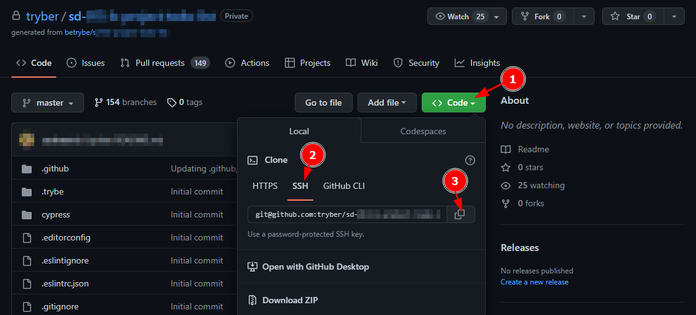
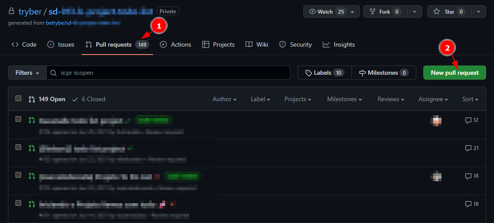
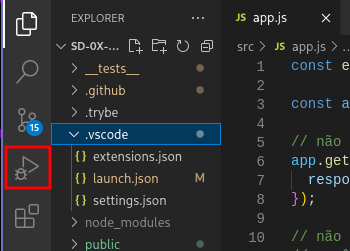
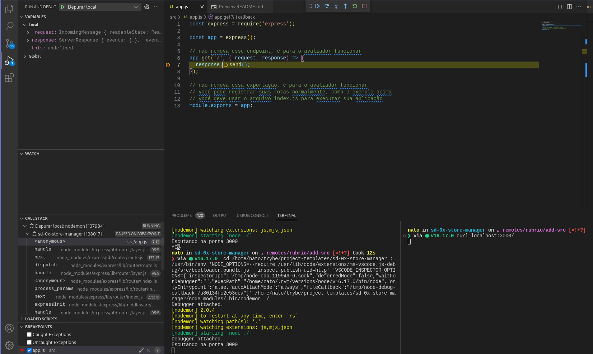
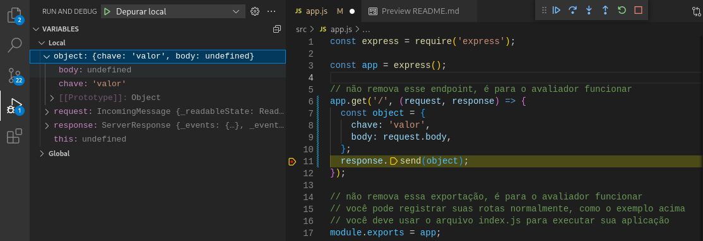

# Dúvidas frequentes

Abaixo estão algumas orientações e dúvidas comuns ao desenvolvimento do projeto.

Se houver qualquer outra dúvida ou problema, é só procurar a monitoria ou postar uma thread no slack. Estamos juntos! 👍

## Git e GitHub

<details>
<summary>‼️ Antes de começar a desenvolver</summary>

1. Clone o repositório

   - Copie o endereço SSH do repositório e use-o para cloná-lo em sua máquina:
     - Por exemplo: `git clone git@github.com:tryber/sd-0x-project-x.git`.

     <details><summary>🖼️ Local do endereço SSH na página inicial do repositório:</summary>

     

     </details>
   - Entre na pasta do repositório que você acabou de clonar:
     - `cd <diretório-do-projeto>`

2. Crie uma branch a partir da branch `main`

   - Verifique que você está na branch `main`
     - Exemplo: `git branch`
   - Se não estiver, mude para a branch `main`
     - Exemplo: `git checkout main`
   - Agora crie uma branch à qual você vai submeter os `commits` do seu projeto
     - Você deve criar uma branch no seguinte formato: `nome-de-usuário-nome-do-projeto`
     - Exemplo: `git checkout -b joãozinho-project-x`

3. Para cada etapa do desenvolvimento, adicione as mudanças ao _stage_ do Git e faça um `commit`

   - Verifique que as mudanças ainda não estão no _stage_
     - Exemplo: `git status` (devem aparecer listadas as alterações realizadas em vermelho)
   - Adicione o novo arquivo ao _stage_ do Git
     - Exemplo:
       - `git add .` (adicionando todas as mudanças - _que estavam em vermelho_ - ao stage do Git)
       - `git status` (devem aparecer listadas as alterações realizadas em verde)
   - Faça o `commit` inicial
     - Exemplo:
       - `git commit -m 'Iniciando o projeto X! #VQV 🚀'` (fazendo o primeiro commit)
       - `git status` (deve aparecer uma mensagem tipo _nothing to commit_ )

4. Adicione a sua branch com o novo `commit` ao repositório remoto

   - Usando o exemplo anterior: `git push -u origin joãozinho-sd-0x-project-x`

5. Crie um novo `Pull Request` _(PR)_

   - Vá até a página de _Pull Requests_ do repositório no GitHub.
      <details><summary>🖼️ Local da página de Pull Requests no repositório:</summary>

     

     </details>
   - Clique no botão verde _"New pull request"_
   - Clique na caixa de seleção _"Compare"_ e escolha a sua branch **com atenção**
   - Clique no botão verde _"Create pull request"_
   - Adicione uma descrição para o _Pull Request_ e clique no botão verde _"Create pull request"_
   - **Não se preocupe em preencher mais nada por enquanto!**
   - Volte até a página de _Pull Requests_ do repositório e confira que o seu _Pull Request_ está criado

</details>

<details>
<summary>⌨️ Durante o desenvolvimento</summary>

- Faça `commits` das alterações que você fizer no código regularmente

- Lembre-se de sempre após um (ou alguns) `commits` atualizar o repositório remoto

- Os comandos que você utilizará com mais frequência são:
    1. `git status` _(para verificar o que está em vermelho - fora do stage - e o que está em verde - no stage)_
    2. `git add` _(para adicionar arquivos ao stage do Git)_
    3. `git commit` _(para criar um commit com os arquivos que estão no stage do Git)_
    4. `git push -u nome-da-branch` _(para enviar o commit para o repositório remoto na primeira vez que fizer o `push` de uma nova branch)_
    5. `git push` _(para enviar o commit para o repositório remoto após o passo anterior)_

</details>

<details>
<summary>🤝 Depois de terminar o desenvolvimento (opcional)</summary>

  Para **"entregar"** seu projeto, siga os passos a seguir:

- Vá até a página **DO SEU** _Pull Request_, adicione a label de _"code-review"_ e marque seus colegas
    - No menu à direita, clique no _link_ **"Labels"** e escolha a _label_ **code-review**
    - No menu à direita, clique no _link_ **"Assignees"** e escolha **o seu usuário**
    - No menu à direita, clique no _link_ **"Reviewers"** e digite `students`, selecione o time `tryber/students-sd-xx` onde `xx` é o número da sua turma

Se ainda houver alguma dúvida sobre como entregar seu projeto [aqui tem um video explicativo](https://vimeo.com/362189205).

</details>

<details>
<summary>🕵🏿 Revisando um pull request</summary>

  Use o conteúdo sobre [Code Review](https://app.betrybe.com/learn/course/5e938f69-6e32-43b3-9685-c936530fd326/module/f04cdb21-382e-4588-8950-3b1a29afd2dd/section/b3af2f05-08e5-4b4a-9667-6f5f729c351d/lesson/36268865-fc46-40c7-92bf-cbded9af9006) para te ajudar a revisar os _Pull Requests_.

</details>

## Node e NPM

<details>
<summary> 🚀 Estrutura e comandos NPM do projeto</summary>

Este projeto tem a seguinte estrutura simplificada:

```text
.
├── __tests__/  
│   ├── e2e/           # pasta com os testes do avaliador
│   └── package.json
├── backend/
│   ├── src/           # pasta com o código da aplicação
│   ├── tests/         # pasta com os testes do Mocha
│   └── package.json
├── sql/               # pasta com os arquivos de migração e seed
└── package.json
```

O arquivo `package.json` que está na raiz do projeto chama os comandos que estão nos `package.json` dos diretórios `__tests__` e`backend` utilizando o [parâmetro `--prefix`](https://docs.npmjs.com/cli/v9/using-npm/config#prefix).

Por isso, todos os comandos abaixo podem ser executados direto da raiz do projeto.

> Nota: Caso não sejam definidas variáveis de ambiente, os scripts irão assumir valores como os em [`env.example`](./env.example).

|Comando|Descrição|
|--|--|
|`npm run dev:local`|Roda a aplicação localmente (não é necessário caso esteja executando o container `backend` do Compose)|
|`npm test`|Roda os testes do avaliador no terminal|
|`npm run cy:open`|Abre a janela do Cypress para rodar os testes do avaliador por lá|
|`npm run test:mocha`|Roda os testes do Mocha|
|`npm run test:coverage`|Gera o relatório de cobertura de testes do Mocha|
|`npm run test:mutation`|Roda os testes de mutação do Stryker|
|`npm run lint`|Roda o linter|
|`npm run migration`|Roda as migrações do banco de dados|
|`npm run seed`|Roda as seeds do banco de dados|
|`npm run db:reset`|Reseta o banco de dados (roda as migrações e as seeds)|
|`npm run postinstall`|Instala as dependências dos diretórios `__tests__` e `backend`|

</details>

<details>
<summary>⚠️ Não rode o comando npm audit fix!</summary>

- Ele atualiza várias dependências do projeto, e essa atualização gera conflitos com o avaliador.

</details>

<details>
<summary>🔁 Live reload com Nodemon</summary>

Usaremos o [Nodemon](https://nodemon.io) para monitorar as mudanças nos arquivos e reiniciar o servidor automaticamente.

Este projeto já vem com as dependências relacionadas ao _nodemon_ configuradas no arquivo `package.json`.

Para iniciar o servidor localmente em modo de desenvolvimento basta executar o comando `npm run dev:local`. Este comando fará com que o servidor reinicie de forma automática ao salvar uma modificação realizada nos arquivos do projeto.
</details>

<details>
<summary>🧹 Rodando o linter com npm run lint</summary>

Usaremos o [ESLint](https://eslint.org/) para fazer a análise estática do seu código.

Este projeto já vem com as dependências relacionadas ao _linter_ configuradas nos arquivos `package.json`.

Para poder rodar o `ESLint` em um projeto basta executar o comando `npm install` dentro do projeto e depois `npm run lint`. Se a análise do `ESLint` encontrar problemas no seu código, tais problemas serão mostrados no seu terminal. Se não houver problema no seu código, nada será impresso no seu terminal.

Você pode também instalar o plugin do `ESLint` no `VSCode`. Para isso, basta fazer o download do [plugin `ESLint`](https://marketplace.visualstudio.com/items?itemName=dbaeumer.vscode-eslint) e instalá-lo.

</details>

<details>
<summary>🧪 Rodando testes do avaliador com Cypress</summary>

Usaremos o [Cypress](https://www.cypress.io/) para fazer os testes automatizados. Os testes estão localizados na pasta `__tests__/cypress/e2e`.

É possível rodá-los diretamente da raiz do projeto. Seguem algumas maneiras de rodar os testes com Cypress:

|Comando|Resultado|
|---|---|
|`npm test`|Executa todos os testes pelo terminal|
|`REQ=01 npm test`|Executa os testes do requisito 01 pelo terminal|
|`npm run cy:open`|Abre a janela do Cypress para selecionar o teste que quer executar|
|`DEBUG=1 npm test`|Executa os testes pelo terminal e mostra mais detalhes sobre os comandos utilizados pelo avaliador|

</details>

<details>
<summary>🧪 Rodando testes com Mocha</summary>

Você irá escrever testes unitários para o código que desenvolveu. Os testes deverão ser escritos na pasta `backend/tests`.

Além do [Mocha](https://mochajs.org/), [Chai](https://www.chaijs.com/) e [Sinon](https://sinonjs.org/), usaremos o [Istambul](https://istanbul.js.org/) e o [Stryker](https://stryker-mutator.io/) para analisar a cobertura de testes e mutação de código, respectivamente.

É possível rodá-los diretamente da raiz do projeto. Seguem algumas maneiras de rodar os testes com Mocha:

|Comando|Resultado|
|---|---|
|`npm run test:mocha`|Executa todos os testes pelo terminal|
|`npm run test:coverage`|Executa todos os testes e mostra a cobertura de testes|
|`npm run test:mutation`|Executa todos os testes e mostra a cobertura de mutação|

</details>

## Erros comuns

<details>
<summary> ⛔ Erro de porta já utilizada: EADDRINUSE ou port is already allocated</summary>


- Se você se deparar com esse tipo de erro, quer dizer que sua aplicação já está utilizando a `porta 3001`, seja com outro processo do Node.js ou algum container Docker!

    - Você pode parar todos os processos Node com o comando `killall node`;

    - Você pode parar um container Docker com o comando `docker stop <nome-do-container>`.

- ✨ **Dica:** Antes de iniciar qualquer coisa, observe os containers que estão em execução em sua máquina usando o comando `docker container ls`;

</details>

## Rodando o projeto pelo Docker

<details>
<summary>⚠️ Rode comandos do Git fora do container Node</summary>

- O **git** dentro do container não vem configurado com suas credenciais. Ou faça os commits fora do container, ou configure as suas credenciais do git dentro do container.

</details>

<details>
<summary>⚠️ Use a versão 2.5 ou superior do Docker Compose</summary>

- Para que você consiga rodar o seu projeto com docker e o avaliador funcione é fundamental que o seu docker compose esteja na **versão 2.5** ou superior.

    - Verifique sua versão:

  ```bash
  docker-compose --version
  ```

  Se não for a versão 2.5 ou superior, faça os seguintes comandos para atualizar a versão:

  ```bash
  sudo rm /usr/local/bin/docker-compose
  sudo curl -L "https://github.com/docker/compose/releases/download/v2.5.0/docker-compose-$(uname -s)-$(uname -m)" -o /usr/local/bin/docker-compose
  sudo chmod +x /usr/local/bin/docker-compose
  ```

</details>

### Dicas

<details>
<summary>✨ Desenvolvendo o projeto no VS Code de dentro do container</summary>

- A extensão `Dev Containers` (que estará na seção de extensões recomendadas do VS Code) é indicada para que você possa desenvolver sua aplicação no container Docker direto no VS Code, como você faz com seus arquivos locais.

  

</details>

<details>
<summary id="debugging">🐞🗡️ Depuração (Debugger)</summary>

Existe nesse projeto uma configuração de depuração para o VS Code, localizada na pasta `.vscode`. Você pode clicar no ícone de _Debugger_ ou usar a _shortcut_ `Ctrl + Shift + D` (no linux) para abri-lo:



Vai parecer uma interface assim no canto superior do seu VScode:


O simbolo 🔽 é uma caixa de seleção, como um `<select>` HTML, este abriga os modos de depuração que o VScode encontrou.

|Modo de Depuração|Descrição|
|---|---|
|`Depurar Localmente`|Executa sua API usando o `nodemon` e com o _debugger_ do VScode ativo. Você poderá acessar sua API normalmente, mas o código parará de executar nos _breakpoints_ que definir.|
|`Depurar com Docker`|Como o último, mas o VScode usa a porta `9229` para atracar com o código da API no _container_, se quiser fazer requisições para API deve usar a porta que o _container_ mapeou para o `localhost`|
|`Depurar testes do Mocha`|Invés de executar a API em modo de depuração, executa o _script_ de testes do `mocha` que deve criar para esse projeto. Você pode usar os _breakpoints_ da mesma forma.|

Como depurar:

1. Para iniciar a depuração basta clicar no _play_ verde ▶️.
   - Inicialmente vai parecer que nada aconteceu, mas vai aparecer essa barrinha no topo da sua tela:

      

2. Agora você consegue ativar os _breakpoints_ ⏺️ ao lado do número da linha:

    

    - Quando clicar nele, este ficar vermelho e quando a API executar essa linha, ela vai parar.

3. Com tudo preparado, vamos fazer um teste, vou fazer uma requisição para acionar a execução da linha 7 do `src/app.js`:

    

    - Note que todas a variáveis do escopo local (`_request`, `response`, `this`) de onde o cursor está podem ser inspecionadas.


4. Agora é com você! ✨

Mas vou deixar aqui uma colinha de como funciona cada ícone da barra de depuração:

|Ícone|Nome|Descrição|
|---|---|---|
|▶️|Continue|Vai executar o código até chegar no próximo _breakpoint_, dar um erro ou não haver mais o que executar|
|⤵️|Step Over|Executa linha atual e pula para a próxima|
|⬇️|Step Into|Entra dentro da função que vai ser executada na linha do cursor|
|⬆️|Step Out|Saí da função que vai ser executada na linha do cursor, executando o resto dela|
|🔄|Restart|Reinicia o processo de depuração, matando o processo atual e criando um novo|
|⏹️|Stop|Para o processo de depuração, mata o processo|

> ❓ Talvez você tenha se perguntado: uai, mas não tem como voltar?
>
> Realmente não tem, é um processo que só vai na direção que o código executa. Logo, para "voltar uma linha" é preciso que ativemos o gatilho que faz o depurador passar por aquela linha que a gente quer voltar, fazendo uma nova requisição por exemplo.

</details>
