# Boas-vindas ao repositório do projeto Trybetunes!

Para realizar o projeto, atente a cada passo descrito a seguir e, se tiver qualquer dúvida, nos envie por Slack! #vqv 🚀

Aqui você vai encontrar os detalhes de como estruturar o desenvolvimento de seu projeto com base neste repositório utilizando uma branch específica e um Pull Request para colocar seus códigos.

# Termos e acordos

Ao iniciar este projeto, você concorda com as diretrizes do Código de Conduta e do Manual da Pessoa Estudante da Trybe.

# Entregáveis

<details>
  <summary><strong>🤷🏽‍♀️ Como entregar</strong></summary><br />

  Para entregar seu projeto, você deverá criar um *Pull Request* neste repositório.

  Lembre-se de que você pode consultar nosso conteúdo sobre [Git & GitHub](https://app.betrybe.com/course/4d67f5b4-34a6-489f-a205-b6c7dc50fc16/) e nosso [Blog - Git & GitHub](https://blog.betrybe.com/tecnologia/git-e-github/) sempre que precisar!
</details>

<details>
  <summary><strong>👨‍💻 O que deverá ser desenvolvido</strong></summary><br />

  Neste projeto, você vai criar o TrybeTunes, uma aplicação capaz de reproduzir músicas dos mais variados artistas e bandas, criar uma lista de músicas favoritas e editar o perfil da pessoa usuária logada. Essa aplicação será capaz de:

  - Fazer login.
  - Pesquisar por uma banda ou um artista.
  - Listar os álbuns disponíveis dessa banda ou desse artista.
  - Visualizar as músicas de um álbum selecionado.
  - Reproduzir uma prévia das músicas do álbum.
  - Favoritar e desfavoritar músicas.
  - Ver a lista de músicas favoritadas.
  - Ver o perfil da pessoa logada.
  - Editar o perfil da pessoa logada.

</details>

<details>
  <summary><strong>:memo: Habilidades</strong></summary><br />

Neste projeto, verificamos se você é capaz de:

- Fazer requisições e consumir dados vindos de uma `API`.

- Utilizar o hook `useEffect`.

- Utilizar o hook `useState`.

- Utilizar o componente `BrowserRouter` corretamente.

- Criar rotas, mapeando o caminho da URL com o componente correspondente via `Route`.

- Utilizar o `Routes` do `React Router Dom`.

- Criar links de navegação na aplicação com o componente `Link`.

</details>

<details>
  <summary><strong>🗓 Data de entrega</strong></summary><br />
  
  * Este projeto é individual;
  * Serão `4` dias de projeto;
  * Data para entrega final do projeto: `04/09/2023 23:59`.

</details><br />

# Orientações

<details>
  <summary><strong>‼️ Antes de começar a desenvolver</strong></summary><br />

  1. Clone o repositório

  - Use o comando: `git clone git@github.com:tryber/sd-0x-project-trybetunes.git`.
  - Entre na pasta do repositório que você acabou de clonar:
    - `cd sd-0x-project-trybetunes`

  2. Instale as dependências

  - `npm install`.
  
  3. Crie uma branch a partir da branch `master`

  - Verifique se você está na branch `master`.
    - Exemplo: `git branch`
  - Se não estiver, mude para a branch `master`.
    - Exemplo: `git checkout master`
  - Agora crie uma branch à qual você vai submeter os `commits` do seu projeto
    - Você deve criar uma branch no seguinte formato: `nome-de-usuario-nome-do-projeto`
    - Exemplo: `git checkout -b joaozinho-sd-0x-project-trybetunes`

  4. Adicione as mudanças ao _stage_ do Git e faça um `commit`

  - Verifique se as mudanças ainda não estão no _stage_.
    - Exemplo: `git status` (deve aparecer listada a pasta _joaozinho_ em vermelho)
  - Adicione o novo arquivo ao _stage_ do Git.
    - Exemplo:
      - `git add .` (adicionando todas as mudanças - _que estavam em vermelho_ - ao stage do Git)
      - `git status` (deve aparecer listado o arquivo _joaozinho/README.md_ em verde)
  - Faça o `commit` inicial.
    - Exemplo:
      - `git commit -m 'iniciando o projeto x'` (fazendo o primeiro commit)
      - `git status` (deve aparecer uma mensagem do tipo _nothing to commit_ )

  5. Adicione sua branch com o novo `commit` ao repositório remoto

  - Usando o exemplo anterior: `git push -u origin joaozinho-sd-0x-project-trybetunes`

  6. Crie um `Pull Request` _(PR)_

  - Vá até a página de _Pull Requests_ do [repositório no GitHub](https://github.com/tryber/sd-0x-project-trybetunes/pulls)
  - Clique no botão verde _"New pull request"_
  - Clique na caixa de seleção _"Compare"_ e escolha a sua branch **com atenção**
  - Coloque um título para a sua _Pull Request_
    - Exemplo: _"Cria tela de busca"_
  - Clique no botão verde _"Create pull request"_.
  - Adicione uma descrição para o _Pull Request_ e clique no botão verde _"Create pull request"_.
  - **Não se preocupe em preencher mais nada por enquanto!**
  - Volte até a [página de _Pull Requests_ do repositório](https://github.com/tryber/sd-0x-project-trybetunes/pulls) e confira que o seu _Pull Request_ está criado

</details>

<details>
  <summary><strong>⌨️ Durante o desenvolvimento</strong></summary><br />

  - Faça regularmente `commits` das alterações que você fizer no código.

  - Lembre-se de sempre atualizar o repositório remoto após um (ou alguns) `commits`. 

  - Os comandos que você utilizará com mais frequência são:
    1. `git status` _(para verificar o que está em vermelho - fora do stage - e o que está em verde - no stage)_
    2. `git add` _(para adicionar arquivos ao stage do Git)_
    3. `git commit` _(para criar um commit com os arquivos que estão no stage do Git)_
    4. `git push -u origin nome-da-branch` _(para enviar o commit para o repositório remoto na primeira vez que fizer o `push` de uma nova branch)_
    5. `git push` _(para enviar o commit para o repositório remoto após o passo anterior)_

</details>

<details>
  <summary><strong>🤝 Depois de terminar o desenvolvimento (opcional)</strong></summary><br />

  Para sinalizar que seu projeto está pronto para o _"Code Review"_, faça o seguinte:

  - Vá até a página **DE SEU** _Pull Request_, adicione a label de _"code-review"_ e marque seus colegas:

    - No menu à direita, clique no _link_ **"Labels"** e escolha a _label_ **code-review**.

    - No menu à direita, clique no _link_ **"Assignees"** e escolha **seu usuário**.

    - No menu à direita, clique no _link_ **"Reviewers"** e digite `students`, selecione o time `tryber/students-sd-034`.

  Caso tenha alguma dúvida, [assista a este vídeo explicativo](https://vimeo.com/362189205).

</details>

<details>
  <summary><strong>🕵🏿 Revisando um pull request</strong></summary><br />

  Use o conteúdo sobre [Code Review](https://course.betrybe.com/real-life-engineer/code-review/) para revisar os _Pull Requests_.

</details>

<details>
  <summary><strong>🎛 Linter</strong></summary><br />

  Para garantir a qualidade do código, utilize neste projeto os linters `ESLint` e `StyleLint`.
  Assim, o código estará alinhado com as boas práticas de desenvolvimento, além de ser mais legível
  e de fácil manutenção. Para rodá-lo localmente no projeto, execute os comandos a seguir.

  ```bash
    npm run lint
    npm run lint:styles
  ```

  ⚠️ **PULL REQUESTS COM ERROS DE LINTER NÃO SERÃO AVALIADAS.
  ATENTE PARA RESOLVÊ-LAS ANTES DE FINALIZAR O DESENVOLVIMENTO!** ⚠️

  Em caso de dúvidas, confira o material do course sobre [ESLint e Stylelint](https://app.betrybe.com/course/real-life-engineer/eslint).
</details>

<details>
  <summary><strong>🛠 Testes</strong></summary><br />

  Neste projeto, utilizamos a [React Testing Library (RTL)](https://testing-library.com/docs/react-testing-library/intro) para a execução dos testes.

  Na descrição dos requisitos a seguir, será pedida a adição de atributos `data-testid` aos elementos _HTML_. Observe este exemplo para entender melhor essa configuração: se o requisito pedir _"crie um botão e adicione o id de teste (ou `data-testid`) com o valor `my-action`, você poderá escrever_:

  ```html
  <button data-testid="my-action"></button>
  ```

  ou

  ```html
  <a data-testid="my-action"></a>
  ```

  Ou seja, o atributo `data-testid="my-action"` servirá para o React Testing Library (RTL) identificar o elemento e, desse modo, conseguir realizar testes focados no comportamento da aplicação.

  **ATENÇÃO!** Muito cuidado com os nomes especificados nos requisitos! O conteúdo deve ser exatamente igual ao texto descrito no requisito.

  Para verificar a solução proposta, você pode executar todos os testes localmente. Para isso, basta executar:

  ```bash
  npm test
  ```

  ### Dica: desativando testes

  Especialmente no início, quando a maioria dos testes está falhando, a saída após executar os testes é extensa. Você pode desabilitar temporariamente um teste utilizando a função `skip` junto à função `it`. Como o nome indica, essa função "pula" um teste:

  ```js
  it.skip('Será validado se existe uma página para rotas não mapeadas', () => {
    renderPath('/not-found');

    expect(screen.getByText('Página não encontrada')).toBeInTheDocument();
  });
  ```
  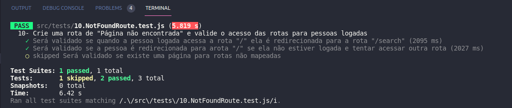

  Uma estratégia é pular todos os testes no início e implementar um teste de cada vez, removendo dele a função `skip`.

  Você também pode rodar apenas um arquivo de teste. Por exemplo:

  ```bash
  npm test 01.LoginPage.test.js
  ```

  ou

  ```bash
  npm test 01.LoginPage
  ```

  Outro modo de driblar esse problema é a utilização da função `.only` após o `it`. Com isso, será possível que apenas um requisito rode localmente e seja avaliado.

  ```js
  it.only('Será validado se existe uma página para rotas não mapeadas', () => {
    renderPath('/not-found');

    expect(screen.getByText('Página não encontrada')).toBeInTheDocument();
  });
  ```
  

  ⚠️ **O avaliador automático não necessariamente avalia seu projeto na ordem em que os requisitos aparecem no readme. Isso acontece para deixar o processo de avaliação mais rápido. Então, não se assuste se isso acontecer, ok?**
</details>

<details>
  <summary><strong>✔ Evaluator</strong></summary><br />

  O Evaluator do GitHub é uma ferramenta de código aberto que permite executar testes automatizados em projetos hospedados no GitHub. Aprenda a seguir como usar o Evaluator do GitHub para visualizar a execução dos testes.

  1. Acessar o painel do Evaluator

* Ao subir um novo _commit_ para o _Pull Request_ do projeto, o avaliador irá começar a rodar as _actions_ dele para avaliar o nosso código:

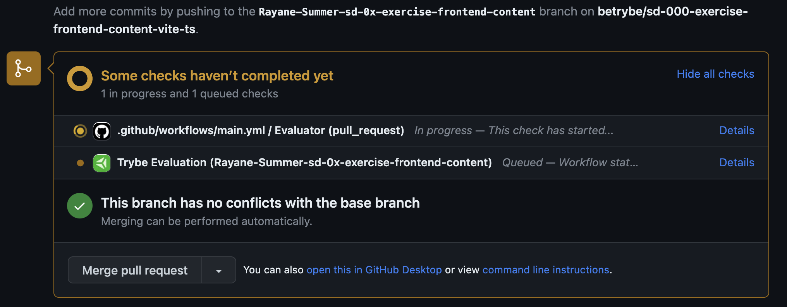

* Clique em `Details` para acessar o painel:

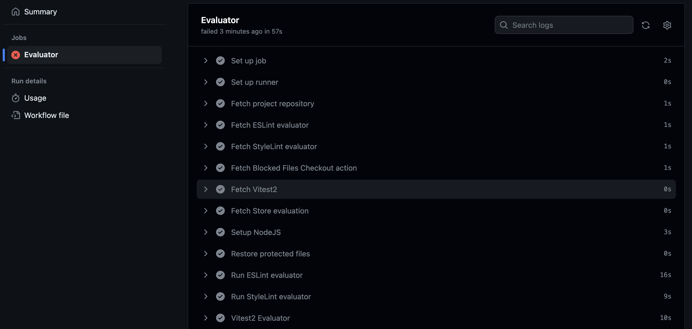

  2. Visualizar os testes

* No painel do _Evaluator_, procure pela seção `Vitest2 Evaluator`. Nela, estão descritos os testes do repositório, como a imagem a seguir:

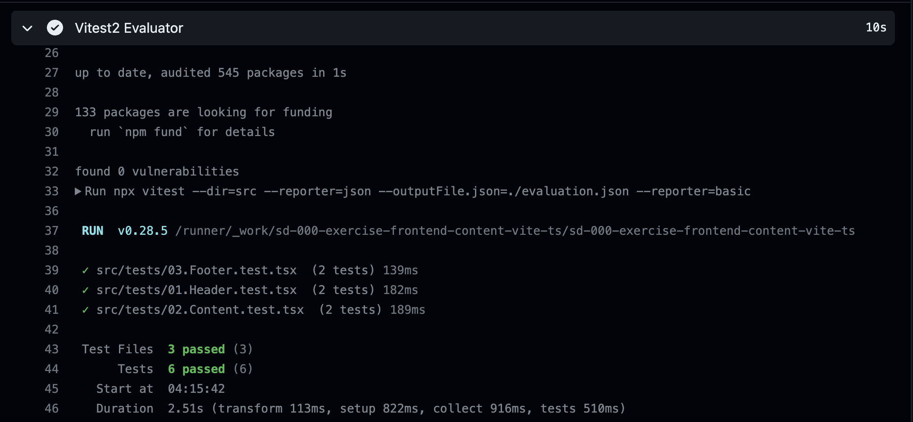

* Caso algum teste falhe, o erro também será apontado na mesma seção:

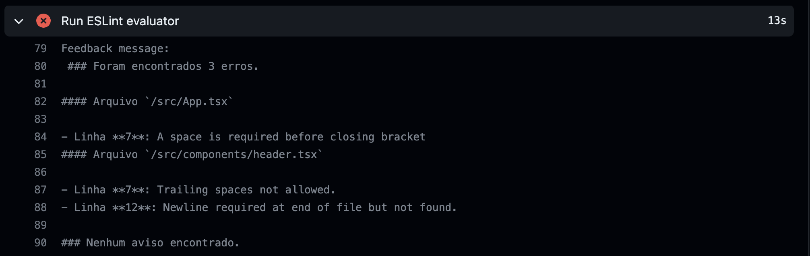

  3. _Re-run jobs_: Rodando os testes novamente

* Para executar o _Evaluator_ novamente, clique no botão `Re-run jobs` no canto superior direito do painel. Note que é possível rodar todos os testes novamente ou apenas os que falharam:

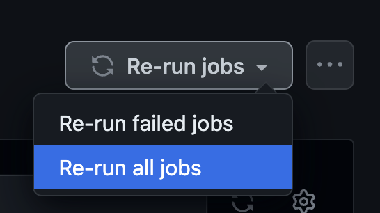

> **Atenção ⚠️:** Rodar os testes novamente **não significa** que eles serão aprovados pelo _Evaluator_.

* Após selecionar uma opção, o _Evaluator_ iniciará uma nova execução e apresentará uma nova tela, carregando todos os testes novamente.

</details>

<details>
  <summary><strong>:convenience_store: Desenvolvimento </strong></summary><br />

  Nos últimos projetos, por mais que o app tenha sido desenvolvido utilizando múltiplos componentes, o que é uma boa prática, todas as funcionalidades eram acessadas ao mesmo tempo, no mesmo lugar, utilizando apenas uma URL (`localhost:5173`, normalmente). À medida que seus apps se tornarem maiores e mais complexos, isso será inviável. Desta vez, as funcionalidades do app serão agrupadas e organizadas em rotas.

  Uma rota define o que deve ser renderizado na página ao abri-la. Cada rota está associada a um caminho. O caminho é a parte da URL após o domínio (nome do site, de forma simplificada). Por exemplo, em `www.site.com/projetos/meu-jogo`, o caminho é `/projetos/meu-jogo`. Até agora, todos os apps React que você desenvolveu tinham somente uma rota, a raiz (`/`).

  Outra diferença importante neste projeto em relação aos anteriores é que você vai consumir e enviar dados para APIs para pesquisar a banda ou o artista, recuperar as músicas de cada álbum e salvar as músicas favoritas, além de editar as informações da pessoa logada. Desse modo, você terá de lidar com requisições assíncronas e promises. Também deverá fazer uso dos efeitos colaterais (`useEffect`) e de estados para controlar o que é renderizado por seus componentes dependendo do momento em que as requisições se encontram.

  ### Como desenvolver

  Este repositório já contém um template com um App React criado. Após clonar o projeto e instalar as dependências, você deverá completar esse template implementando os requisitos listados na seção [Requisitos](#requisitos).

  Também já existe no projeto um diretório `src/services` que contém os arquivos `favoriteSongsAPI.ts`, `searchAlbumsAPI.ts`, `userAPI.ts` e `musicsAPI.ts`. Esses arquivos serão responsáveis por lidar com as requisições simuladas utilizadas durante o desenvolvimento. Você também vai encontrar o arquivo `src/types.ts`, neste arquivo estão armazenados todos os tipos utilizados pelas funções presentes nos arquivos de serviço mencionados acima. Entenda mais a respeito deles a seguir.

  <details><summary><strong> <code>userAPI.ts</code></strong></summary>

  O arquivo `userAPI.ts` será utilizado para manipular as informações da pessoa logada; dentro dele estarão as funções para recuperar e atualizar as informações da pessoa usuária, além de criar um novo perfil. Todas essas funções simulam o funcionamento de uma API.

  - Para recuperar as informações da pessoa usuária, utilize a função `getUser`. Ela retornará um objeto do tipo `UserType` com as informações da pessoa logada caso exista.
  **Atenção**: caso não encontre nenhuma informação da pessoa usuária, a API retornará um objeto vazio.

  - Para criar um perfil, utilize a função `createUser`, que recebe como parâmetro o objeto que contém as informações da pessoa usuária. Esse objeto deverá conter a seguinte estrutura:

  ```javascript
  {
    name: '',
    email: '',
    image: '',
    description: '',
  }
  ```

  Para atualizar as informações da pessoa logada, utilize a função `updateUser`. Assim como a função anterior, ela recebe um objeto do tipo `UserType` com as informações que serão atualizadas, e esse objeto deve conter a mesma estrutura do anterior.
  </details>

  <details><summary><strong> <code>searchAlbumsAPI.ts</code></strong></summary>

  O arquivo `searchAlbumsAPI.ts` contém uma função que faz uma requisição a uma API e retorna os álbuns de uma banda ou um artista, ou seja, um _array_ do tipo `AlbumType`. Para essa função funcionar, ela recebe como parâmetro uma string, que deve ser o nome da banda ou do artista. O retorno dessa função, quando encontra as informações, é um array com cada álbum dentro de um objeto.
  **Atenção**: caso não encontre nenhuma informação da banda ou do artista, a API retornará um array vazio.
  </details>
  <details><summary><strong> <code>favoriteSongsAPI.ts</code></strong></summary>

  O arquivo `favoriteSongsAPI.ts` é responsável por manipular as informações das músicas favoritas. Nele, há as funções `getFavoriteSongs`, `addSong` e `removeSong`, que recuperam, adicionam e removem músicas dos favoritos, respectivamente. Assim como nos arquivos anteriores, todas as funções simulam o funcionamento de uma API.

  A função `getFavoriteSongs` retorna um array do tipo `SongType` com as músicas favoritadas ou um array vazio caso não haja nenhuma música.

  A função `addSong` recebe um objeto do tipo `SongType` que representa a música que você quer salvar como favorita e adiciona ao array já existente das músicas que já foram favoritadas.

  A função `removeSong` também recebe um objeto do tipo `SongType` que representa a música que você deseja remover da lista de músicas favoritas.

  **Atenção**: os objetos de música precisam ter a chave `trackId` para que elas sejam adicionadas e removidas corretamente.
  </details>
  <details><summary><strong> <code>musicsAPI.ts</code></strong></summary>

  O arquivo `musicsAPI.ts` contém a função `getMusics` que faz uma requisição a uma API e retorna as músicas de um álbum. Ela recebe como parâmetro uma string, que deve ser o id do álbum. O retorno dessa função, quando encontra as informações, é um array em que o **primeiro elemento** é um objeto do tipo `AlbumType` com informações do álbum e o **restante dos elementos** são as músicas do álbum (objetos do tipo `SongType`).
  **Atenção**: caso não encontre nenhuma informação, a API retornará um **array vazio**.
  </details>
</details>

<details>
  <summary><strong>🗣 Nos dê feedbacks sobre o projeto!</strong></summary><br />

Ao finalizar e submeter o projeto, não se esqueça de avaliar sua experiência preenchendo o formulário. 
**Leva menos de 3 minutos!**

[FORMULÁRIO DE AVALIAÇÃO DE PROJETO](https://be-trybe.typeform.com/to/ZTeR4IbH#cohort_hidden=CH34&template=betrybe/sd-0x-project-trybetunes-vite-ts)

</details>

<details>
  <summary><strong>💻 Protótipo do projeto no Figma</strong></summary><br />

  Além da qualidade do código e do atendimento aos requisitos, um bom layout é um dos aspectos responsáveis por melhorar a usabilidade de uma aplicação e turbinar seu portfólio!

  Você pode estar se perguntando: *"Como deixo meu projeto com um layout mais atrativo?"* 🤔

  Para isso, disponibilizamos este [protótipo do Figma](https://www.figma.com/file/pkocuFSMsqmUqvMUbsfcRp/%5BProjeto%5D%5BFrontend%5D-Trybetunes?node-id=0%3A1) para lhe ajudar!

  ⚠️ A estilização de sua aplicação não será avaliada neste projeto, portanto esse protótipo é apenas uma **sugestão** e seu uso é **opcional**. Sinta-se à vontade para modificar o layout e deixá-lo de seu jeito.

</details>

<details>
  <summary><strong>🗂 Compartilhe seu portfólio!</strong></summary><br />

  Você sabia que o LinkedIn é a principal rede social profissional e compartilhar seu aprendizado nela é muito importante caso deseje construir uma carreira de sucesso? Compartilhe esse projeto em seu LinkedIn, marque o perfil da Trybe (@trybe) e mostre à sua rede toda a sua evolução.
</details>

# Rotas necessárias para a aplicação

Você deve utilizar o `BrowserRouter` pra criar as rotas da sua aplicação e cada rota deverá renderizar um componente específico.

Você pode mudar o nome dos componentes se desejar, este é apenas um exemplo.

- A rota `/` irá renderizar a página de `Login`.
- A rota `/search` irá renderizar a página de `Search`.
- A rota `/album/:id` irá renderizar a página de `Album`.
- A rota `/favorites` irá renderizar a página de `Favorites` (bônus).
- A rota `/profile` irá renderizar a página de `Profile` (bônus).
- A rota `/profile/edit` irá renderizar a página de `ProfileEdit` (bônus).
- Qualquer outra rota irá renderizar a página de `NotFound`.

---

# Requisitos

:warning: **PULL REQUESTS COM ERROS DE LINTER NÃO SERÃO AVALIADAS.** :warning:

:warning: Os gifs são meramente ilustrativos para visualizar o fluxo da aplicação, os nomes devem seguir os requisitos e não o gif. :warning:

:warning: Caso você receba o erro de CORS ao realizar requisições no projeto, tente atualizar a página apertando `CTRL + F5`.

## 1. Crie um formulário para identificação
<details><summary>Dentro do componente <code>Login</code>, que deve ser renderizado na rota <code>/</code>, crie um formulário para que a pessoa usuária se identifique com um nome:</summary>

- A rota `/` deve renderizar o componente `Login`.

- Você deve criar um campo para que a pessoa usuária insira seu nome. Este campo deverá ter o atributo `data-testid="login-name-input"`.

- Crie um botão com o texto `Entrar`. Este botão deverá ter o atributo `data-testid="login-submit-button"`.

- O botão para entrar só deve estar habilitado caso o nome digitado tenha 3 ou mais caracteres.

#### Salvando o nome da pessoa usuária

- Ao clicar no botão `Entrar`, utilize a função `createUser` que se encontra no arquivo `src/services/userAPI.ts` para salvar o nome digitado. A função `createUser` espera receber como argumento um objeto com as informações da pessoa e retorna uma `Promise`, que é resolvida quando a informação é salva.

Exemplo de como utilizar a função `createUser`:

```javascript
createUser({ name: "Nome digitado" });
```

> :bulb: *Obs.:* Você verá nos requisitos mais à frente que você poderá passar outras informações para a `createUser`, mas não se preocupe com isso agora. Por enquanto você pode passar somente um objeto com a propriedade `name`.

- Enquanto a informação da pessoa usuária é salva, uma mensagem com o texto `Carregando...` deve aparecer na tela. **:bulb: Dica**: Você precisará dessa mensagem várias vezes no futuro, então é uma boa ideia criar um componente para ela :wink:

- Após a informação ter sido salva, faça um redirect para a rota `/search`.

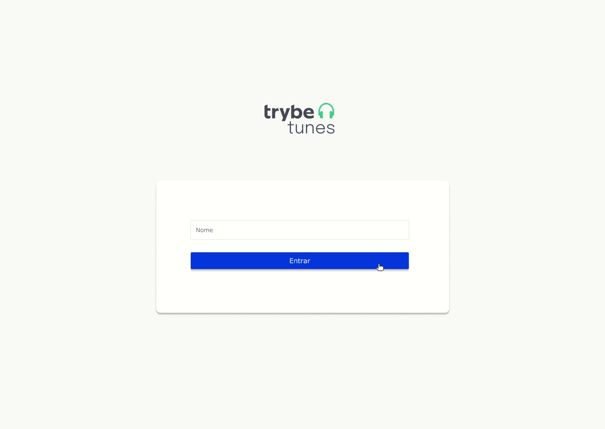

</details><br />

<details>
  <summary><strong>O que será verificado</strong></summary><br />

- Ao navegar para a rota `/`, o input e o botão especificados estão presentes.

- O botão só é habilitado se o input de nome tiver três ou mais caracteres.

- Ao clicar no botão habilitado, a função `createUser` da `userAPI` é chamada.

- Ao clicar no botão, a mensagem `Carregando...` é exibida e os dados do usuário são salvos;
</details>

---

## 2. Crie o formulário para pesquisar artistas

Este formulário deve conter um input e um botão para que seja possível pesquisar os álbuns de uma banda ou artista.

- <details><summary> Crie o formulário dentro do componente <code>Search</code>, que deve ser renderizado na rota <code>/search</code>:</summary>

  - A rota `/search` deve renderizar o componente `Search`.

  - Crie um campo para a pessoa digitar o nome da banda ou artista a ser pesquisada. Esse campo deve ter o atributo `data-testid="search-artist-input"`.

  - Crie um botão que será usado para `Pesquisar`. Esse botão deve ter o atributo `data-testid="search-artist-button"`.

  - O botão só deve estar habilitado caso o nome do artista tenha 2 ou mais caracteres.

  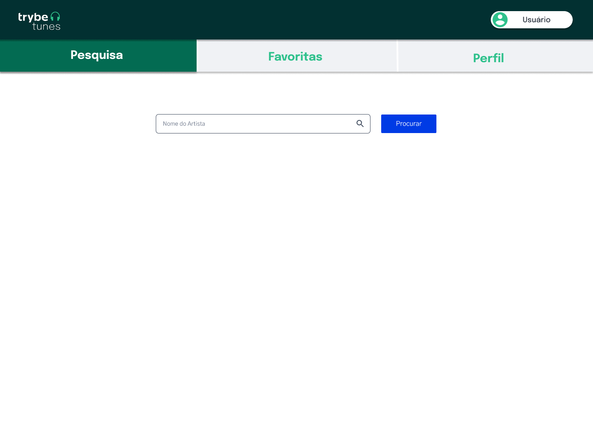
</details>

Com a estrutura da tela de pesquisa criada, agora é hora de fazer uma requisição e receber a lista de álbuns da banda ou artista pesquisada.

- <details><summary> Ao clicar no botão de <code>Pesquisar</code>, limpe o valor do input e faça uma requisição utilizando a função do arquivo <code>services/searchAlbumsAPIs.ts</code>:</summary>

  - :bulb: Lembre-se que essa função espera receber uma string com o nome da banda ou artista.

  - Enquanto aguarda a resposta da API, esconda o input e o botão de pesquisa e exiba a mensagem `Carregando...` na tela.

  - Após receber a resposta da requisição exibir na tela o texto `Resultado de álbuns de: <artista>`, onde `<artista>` é o nome que foi digitado no input.
  - Liste os álbuns retornados:
    - Em cada álbum criar um link para a rota `/album/:id`, onde `:id` é o valor da propriedade `collectionId` de cada Álbum da lista recebida pela API;
    - Este link deve ter o atributo ``data-testid={`link-to-album-${collectionId}`}``.
  > Para que o resultado da API seja exibido mesmo que o usuário acesse outra página e volte para a página de pesquisa, que tal salvar o resultado da API no estado do App? Dessa forma, o estado não será perdido caso a página seja desmontada.
  <br/>
  <details><summary>A API irá retorna um <i>array</i> de objetos. Cada objeto terá a seguinte estrutura:</summary><br />

    ```
      [
        {
          artistId: 12,
          artistName: "Artist Name",
          collectionId: 123,
          collectionName: "Collection Name",
          collectionPrice: 12.25,
          artworkUrl100: "https://url-to-image",
          releaseDate: "2012-03-02T08:00:00Z",
          trackCount: 8,
        },
        {...},
        ...
      ]
    ```
  </details>

  - Se nenhum álbum for encontrado para o nome pesquisado, a API irá retornar um array vazio. Nesse caso, a mensagem `Nenhum álbum foi encontrado` deverá ser exibida:
  
  <br/>
  <details><summary>Ilustrações</summary><br />
  
  
  
  </details>
</details>

</details>

<details>
  <summary><strong>O que será verificado</strong></summary><br />

  - Ao navegar para a rota `/search` através do login, o input e o botão estão presentes na tela;

  - O botão está habilitado somente se o input de nome tiver 2 ou mais caracteres.

  - Ao clicar em `pesquisar`, a requisição é feita usando a `searchAlbumsAPI`;

  - Ao clicar no botão, o texto `Resultado de álbuns de: <artista>` aparece na tela e o input é limpo;

  - Ao receber o retorno da API, os álbuns são listados na tela;

  - Caso a API não retorne nenhum álbum, a mensagem `Nenhum álbum foi encontrado` é exibida;

  - Existe um link para cada álbum listado que redirecione para a rota `/album/:id`.
</details>

---

## 3. Crie a lista de músicas do álbum selecionado

Agora que está tudo pronto, você poderá exibir a lista de músicas do álbum selecionado.

<details><summary>Crie a lista dentro do componente <code>Album</code>, que é renderizado na rota <code>/album/:id</code>: </summary>

- Ao entrar na página, faça uma requisição utilizando a função `getMusics` do arquivo `src/services/musicsAPI.ts`. Lembre-se que essa função espera receber uma string com o id do álbum.
- Enquanto aguarda a resposta da API, exiba a mensagem `Carregando...` na tela.

- Exiba o nome da banda ou artista na tela. Você pode usar qualquer tag HTML que faça sentido, desde que ela tenha o atributo `data-testid="artist-name"`.

- Exiba o nome do álbum na tela. Você pode usar qualquer tag HTML que faça sentido, desde que ela tenha o atributo `data-testid="album-name"`.

- Liste todas as músicas do álbum na tela. Para isso, crie um componente chamado `MusicCard` que deverá exibir o nome da música (propriedade `trackName` no objeto recebido pela API) e um player para tocar o preview da música (propriedade `previewUrl` no objeto recebido pela API).

:bulb: **Dica:** Lembre-se que o retorno da função `getMusics`, quando encontra as informações, é um array onde o primeiro elemento é um objeto com informações do álbum e o restante dos elementos são as músicas do álbum.

  - <details><summary>Exemplo de estrutura do retorno da função getMusics:</summary>

    ```js
    [
      {
        artistName: 'Artist Name',
        collectionName: 'Collection Name',
      },
      {
        trackId: 12,
        trackName: 'Track Name 1',
        previewUrl: 'preview-url-1',
        kind: 'song',
      },
      {
        trackId: 13,
        trackName: 'Track Name 2',
        previewUrl: 'preview-url-2',
        kind: 'song',
      },
      {...},
      ...
    ]
    ```


Para tocar o preview, você deve usar a tag `audio` do próprio HTML. Sua implementação é assim:

```html
<audio data-testid="audio-component" src="{previewUrl}" controls>
  <track kind="captions" />
  O seu navegador não suporta o elemento{" "} <code>audio</code>.
</audio>
```

**Importante:** lembre-se de colocar o atributo `data-testid="audio-component"` na tag `audio` de cada música listada.

  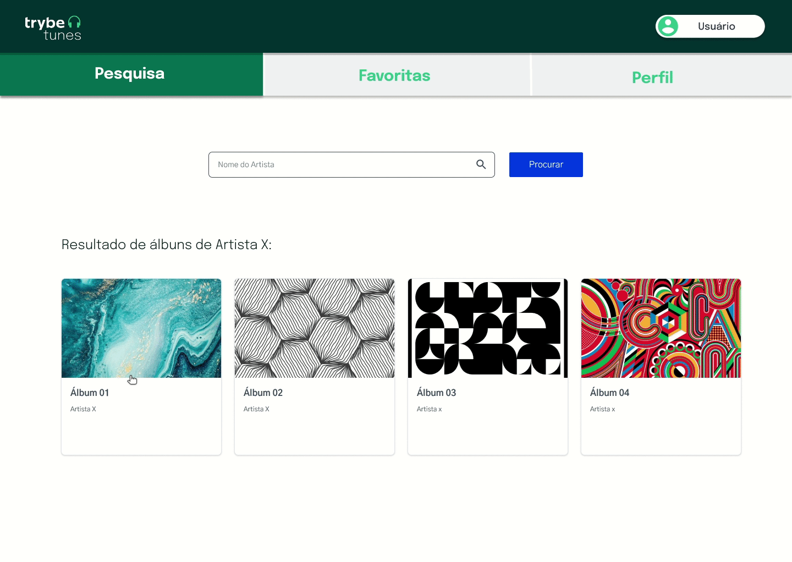
</details><br />

<details>
  <summary><strong>O que será verificado</strong></summary><br />
  
  - Se o serviço de `musicsAPI` está sendo chamado;
  - Se é exibido o texto `Carregando...` enquanto a requisição está sendo feita;
  
  - Se o nome da banda ou artista e o nome do álbum são exibidos;
  
  - Se todas músicas retornadas pela API são listadas.
</details>

---

## 4. Crie um componente de cabeçalho

<details><summary>Crie um componente chamado <code>Header</code>, dentro da pasta <code>src/components</code>:</summary>

- Crie esse componente com a tag `header` envolvendo todo seu conteúdo e com o atributo `data-testid="header-component"`;

- Adicione três NavLinks dentro do componente `Header`.

  - O primeiro link deve redirecionar para a rota `/search` e possuir o data-testid `link-to-search`.

  - O segundo link deve redirecionar para a rota `/favorites` e possuir o data-testid `link-to-favorites`.

  - O terceiro link deve redirecionar para a rota `/profile` e possuir o data-testid `link-to-profile`.

- Utilize a função `getUser` presente no arquivo `src/services/userApi.ts` para recuperar o nome da pessoa logada e exiba essa informação na tela. Você pode usar qualquer tag HTML que faça sentido, desde que ela tenha o atributo `data-testid="header-user-name"`.
- Enquanto estiver aguardando a resposta da `getUser`, exiba apenas a mensagem de `Carregando...`.

Crie um componente chamado `Layout` que deverá renderizar o componente `Header`
- esse layout deverá ser utilizado em uma rota pai de todas as rotas da aplicação, com exceção da página de `Login`.

**⚠️Atenção:** Será necessário o uso do componente `Outlet` da `react-router-dom` para criar o componente `Layout`.

</details><br />

<details>
  <summary><strong>O que será verificado</strong></summary><br />

- Os links de navegação são exibidos no componente `Header`.

- O componente `Layout` faz uso do `Outlet` para renderizar os conteúdos das páginas.

- O componente `Header` não é renderizado na página `/`.

- O componente `Header` é renderizado na página `/search`.

- O componente `Header` é renderizado na página `/album/:id`.

- A função `getUser` é chamada ao renderizar o componente;

- A mensagem de `Carregando...` é exibida ao renderizar o componente e é removida após o retorno da API;

- O nome da pessoa usuária está presente na tela após o retorno da API.

</details>

---

## 5. Crie o mecanismo para adicionar músicas na lista de músicas favoritas

Você já consegue listar as músicas dos álbuns. Nessa etapa você poderá marcar quais são as músicas que você mais gosta.

<details><summary> No componente <code>MusicCard</code>, crie um input do tipo <code>checkbox</code> para marcar as músicas favoritas:</summary>

  - Esse input deve possuir uma label com o atributo ```data-testid={`checkbox-music-${trackId}`}```, onde `trackId` é a propriedade `trackId` do objeto recebido pela API.
  - Caso a musica esteja favoritada, deve ser exibida a imagem `checked_heart.png` dentro da label, caso contrário a imagem `empty_heart.png` deve ser exibida, ambas estão presentes na pasta `src/images`.
  - A imagem deve conter o texto alternativo, `alt`, igual a `favorite`.
  <details><summary><b> Ilustração:</b></summary>

  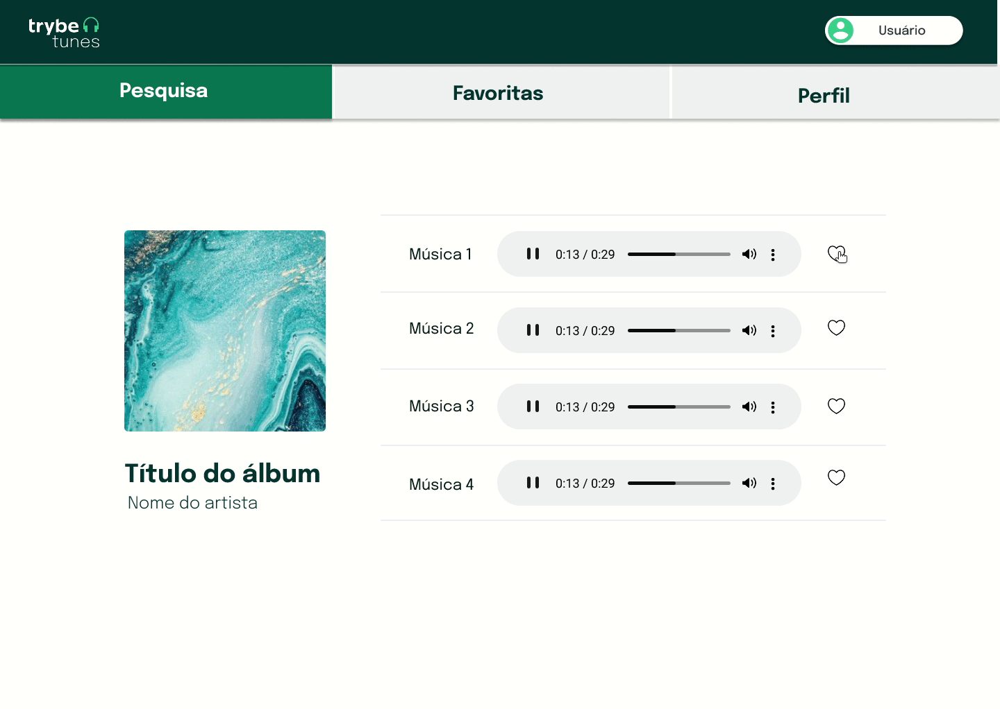
  </details><br />
</details>


<details>
  <summary><strong>O que será verificado</strong></summary><br />

  - Existe um checkbox para cada música da lista.
  - Ao clicar no checkbox, a imagem do coração muda de preenchido para vazio ou vice-versa.
  - A imagem de coração contém o texto alternativo igual a `favorite`.

</details>

---

# Requisitos bônus

## 6. Faça a requisição para adicionar e remover as músicas favoritas ao clicar no checkbox

- <details><summary> Para adicionar uma música a lista de favoritas, utilize a função <code>addSong</code> da <code>favoriteSongsAPI</code></summary>

  - Ao clicar no checkbox, utilize a função `addSong` da `favoriteSongsAPI`. Você deve passar para essa função um objeto no mesmo formato que você recebe da API `getMusics`:

    <details><summary>Ilustração</summary><br />
    
    
    </details>
</details><br />

- <details><summary> Ao clicar em uma música que já está marcada como favorita, ela deve ser removida da lista de músicas favoritas. </summary>

  - Para isso você deve usar a função `removeSong` da `favoriteSongsAPI`. Essa API espera receber um objeto no mesmo formato que foi passado anteriormente para a função `addSong`:

    <details><summary>Ilustração</summary><br />
    
    
    </details>
</details><br />

<details>
  <summary><strong>O que será verificado</strong></summary><br />

  - A função `addSong` é chamada quando algum checkbox é marcado.
  - A função `removeSong` é chamada quando algum checkbox é desmarcado.

</details>

---

## 7. Faça a requisição para recuperar as músicas favoritas

<details><summary> Ao acessar a página do album, faça uma requisição usando a função <code>getFavoriteSongs</code> para atualizar a lista de músicas favoritas:</summary>

- Ao acessar a página de um álbum, faça uma requisição com a função `getFavoriteSongs` da `favoriteSongsAPI`. Essa função retorna um array com as músicas favoritas.

- Enquanto aguarda a resposta da API, exiba a mensagem `Carregando...`.

- Após receber o retorno da função `getFavoriteSongs`, as músicas que já foram favoritadas devem estar com o checkbox marcado como `checked`.

  
</details><br />

<details>
  <summary><strong>O que será verificado</strong></summary><br />

  - A requisição para `getFavoriteSongs` é feita para recuperar as músicas favoritas;

  - Ao entrar na página, o número de checkboxes marcados como `checked` é correspondente ao número de músicas que já foram favoritadas;
</details>

---

## 8. Crie a lista de músicas favoritas

<details><summary> Crie a lista dentro do componente <code>Favorites</code>, que é renderizado na rota <code>/favorites</code>.</summary>

- Ao entrar na página, utilize a função `getFavoriteSongs` da `favoriteSongsAPI` para recuperar a lista de músicas favoritas.

- Enquanto aguarda a resposta da API, exiba a mensagem `Carregando...`.

- Após receber o retorno da função `getFavoriteSongs`, utilize o componente `MusicCard` para renderizar a lista de músicas favoritas.

- Nesta página deve ser possível desfavoritar as músicas.

- A lista apenas exibe músicas favoritas, portanto, ao desfavoritar a música deve ser removida da lista.

  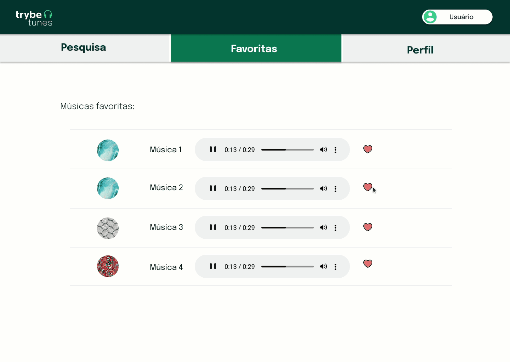
</details><br />

<details>
  <summary><strong>O que será verificado</strong></summary><br />

- A requisição para `getFavoriteSongs` é feita para recuperar as músicas favoritas;

- É exibida a lista de músicas favoritas;

- A lista de músicas favoritas é atualizada ao remover uma música da lista.
</details>

---

## 9. Crie a exibição de perfil

<details><summary> Crie a exibição do perfil dentro do componente <code>Profile</code>, que é renderizado na rota <code>/profile</code></summary>

- Utilize a função `getUser` da `userAPI` para recuperar as informações da pessoa logada.

- Enquanto aguarda a resposta da API, exiba a mensagem `Carregando...`.

- Após receber o retorno da `getUser`, exiba o nome, o email, a descrição e a imagem da pessoa logada.

- Para exibir a imagem, use a tag HTML `img` com o atributo `data-testid="profile-image"`;

- Crie um link que redirecione para a página de edição de perfil (rota `/profile/edit`). Este link deve ter o texto `Editar perfil`.

  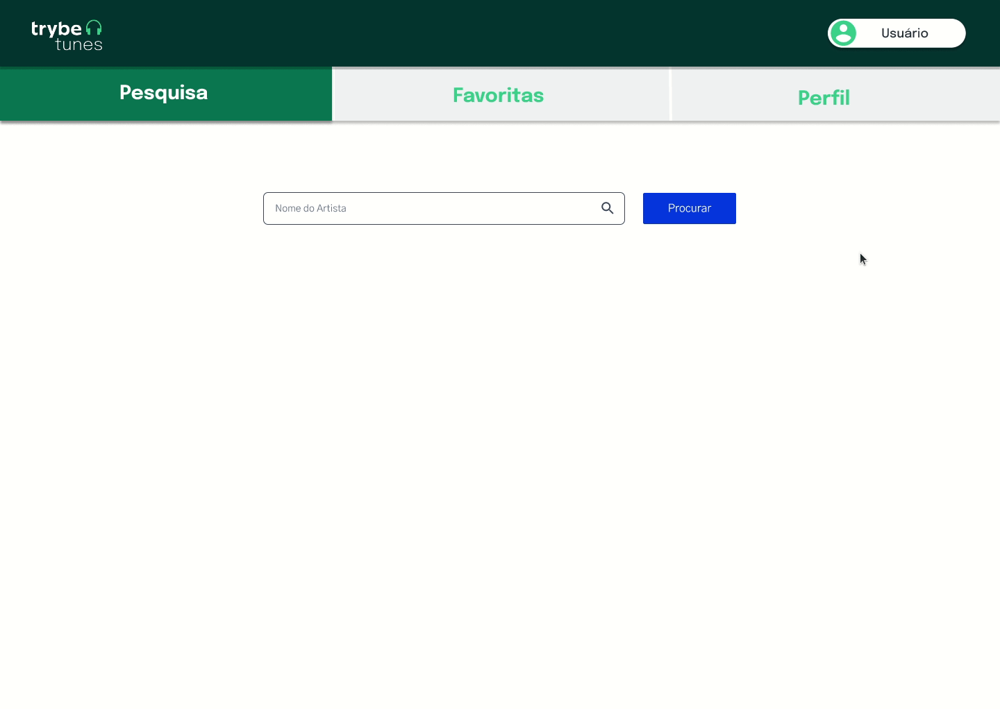
</details><br />

<details>
  <summary><strong>O que será verificado</strong></summary><br />

- A API `getUser` é usada para recuperar as informações da pessoa logada;

- As informações da pessoa logada são exibidas na tela;

- Foi criado um link para a rota de edição de perfil com o texto `Editar perfil`;

- Ao clicar no link `Editar perfil`, a navegação acontece corretamente.
</details>

---

## 10. Crie o formulário de edição de perfil

<details>
<summary>Crie o formulário de edição de perfil dentro do componente <code>ProfileEdit</code>, que é renderizado na rota <code>/profile/edit</code>.</summary><br />

  * <details><summary> Utilize a função <code>getUser</code> da <code>userAPI</code> para recuperar as informações da pessoa logada: </summary>

    * Enquanto aguarda a resposta da API, exiba a mensagem "Carregando...".
    </details>

  * <details><summary> Após receber as informações da pessoa logada, renderize um formulário já preenchido com os seguintes campos:</summary>

    - Um campo para alterar o nome da pessoa usuária. Este campo precisa ter o atributo `data-testid="edit-input-name"`;

    - Um campo para alterar o email da pessoa usuária. Este campo precisa ter o atributo `data-testid="edit-input-email"`;

    - Um campo para alterar a descrição da pessoa usuária. Este campo precisa ter o atributo `data-testid="edit-input-description"`;

    - Um campo para alterar a foto da pessoa usuária. Este campo precisa ter o atributo `data-testid="edit-input-image"`;

    - Um botão para salvar as informações alteradas. Este botão precisa ter o atributo `data-testid="edit-button-save"`.
    </details>

  * <details><summary>Para poder habilitar o botão de enviar, todos os campos precisam estar preenchidos (não podem estar vazios): </summary>

    * O campo de email, além de não estar vazio também precisa verificar que o email tem um formato válido, ou seja, deve seguir o padrão `test@test.com`.
    
    * O botão de salvar as informações só deve ser habilitado quando todos os campos estiverem válidos, ou seja, todos campos preenchidos e o campo de email com um valor em formato válido.

    * Quando o botão estiver habiltado, utilize a função <code>updateUser</code> da <code>userAPI</code> para atualizar as informações da pessoa usuária. Essa API espera receber um objeto no seguinte formato:
    
      ```
        {
          name: '',
          email: '',
          image: '',
          description: '',
        }
      ```

    * Enquanto aguarda a resposta da API, exiba a mensagem `Carregando...`.
    </details>

  * Ao finalizar o processo de edição, redirecione a pessoa logada para a página de exibição de perfil (rota `/profile`).

  <details><summary><b> Ilustração:</b></summary>

  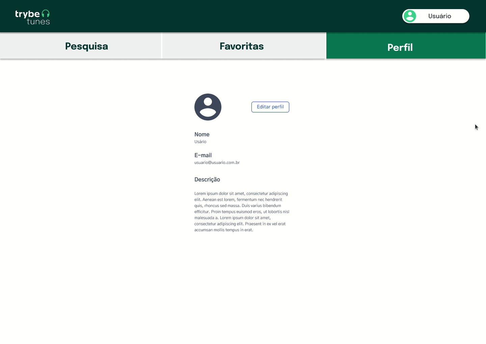
  </details><br />

</details>


<details>
  <summary><strong>O que será verificado</strong></summary><br />

  - É feita a requisição para `getUser` para recuperar as informações da pessoa logada; 

  - O formulário é renderizado já preenchido com as informações da pessoa logada;

  - É possível alterar os valores dos campos;

  - O botão `salvar` é habilitado somente se todos os campos estiverem válidos;

  - As informações são enviadas usando a API `updateUser`;

  - Após salvar as informações a pessoa é redirecionada para a página de exibição de perfil.
</details>

---
